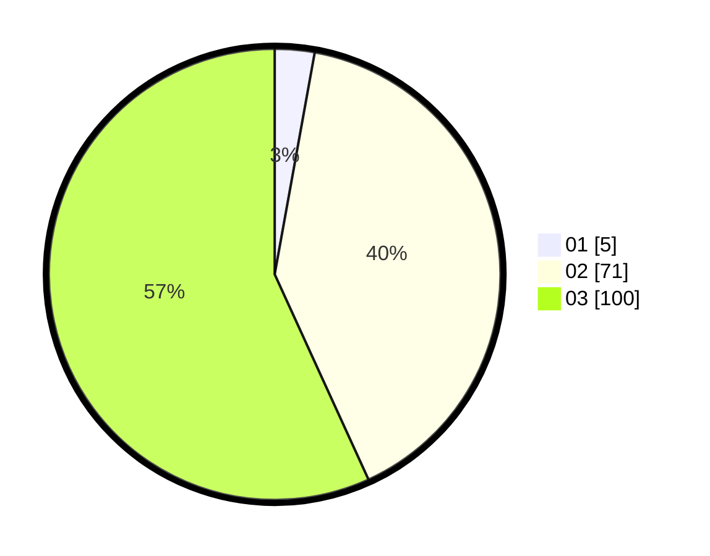

# Hasil

Hasil perolehan suara paslon dapat dilihat pada file paslon-01.txt, paslon-02.txt, dan paslon-03.txt.

Jika tidak ada, artinya data tersebut belum ada pada SIREKAP.

## Perolehan Suara

 * Paslon 01: **5**.
 * Paslon 02: **71**.
 * Paslon 03: **100**.

## Foto C Plano

https://sirekap-obj-formc.kpu.go.id/82a8/pemilu/ppwp/31/73/08/10/01/3173081001187-20240214-225203--edeabb3e-3ccd-463d-9362-4a6c8e167b73.jpg

https://sirekap-obj-formc.kpu.go.id/82a8/pemilu/ppwp/31/73/08/10/01/3173081001187-20240214-225140--c01de129-8853-462d-a818-923b7216d042.jpg

https://sirekap-obj-formc.kpu.go.id/82a8/pemilu/ppwp/31/73/08/10/01/3173081001187-20240214-225109--816a90d4-1250-4035-81ad-bc603b8ce168.jpg
