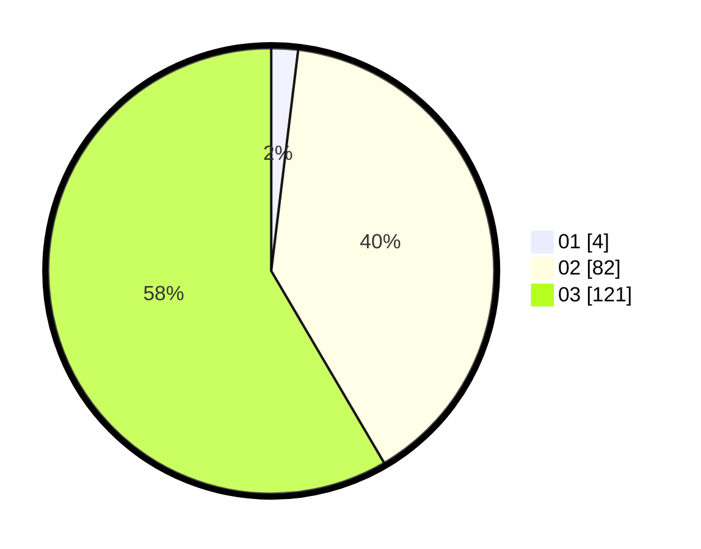

# Hasil

Hasil perolehan suara paslon dapat dilihat pada file paslon-01.txt, paslon-02.txt, dan paslon-03.txt.

Jika tidak ada, artinya data tersebut belum ada pada SIREKAP.

## Perolehan Suara

 * Paslon 01: **4**.
 * Paslon 02: **82**.
 * Paslon 03: **121**.

## Foto C Plano

https://sirekap-obj-formc.kpu.go.id/0681/pemilu/ppwp/31/73/08/10/01/3173081001188-20240214-193936--7a8f7536-2645-4d04-994a-76b2f3f501a0.jpg

https://sirekap-obj-formc.kpu.go.id/0681/pemilu/ppwp/31/73/08/10/01/3173081001188-20240214-205855--c6afa296-d960-4bec-a780-e2e5ec793793.jpg

https://sirekap-obj-formc.kpu.go.id/0681/pemilu/ppwp/31/73/08/10/01/3173081001188-20240214-214442--257fb2ec-d0b9-4c91-b01d-ee0a504a6c60.jpg

## DATA PEMILIH TETAP

Jumlah pemilih dalam DPT: **239**.
 * L: **116**.
 * P: **123**.

## DATA PENGGUNA HAK PILIH

Jumlah pengguna hak pilih dalam DPT: **176**.
 * L: **90**.
 * P: **86**.

Jumlah pengguna hak pilih dalam DPTb: **18**.
 * L: **7**.
 * P: **11**.

Jumlah pengguna hak pilih dalam DPK: **14**.
 * L: **9**.
 * P: **5**.

Jumlah pengguna hak pilih: **208**.
 * L: **106**.
 * P: **102**.

## JUMLAH SUARA SAH DAN TIDAK SAH

JUMLAH SELURUH SUARA SAH: **207**.

JUMLAH SUARA TIDAK SAH: **1**.

JUMLAH SELURUH SUARA SAH DAN SUARA TIDAK SAH: **208**.
