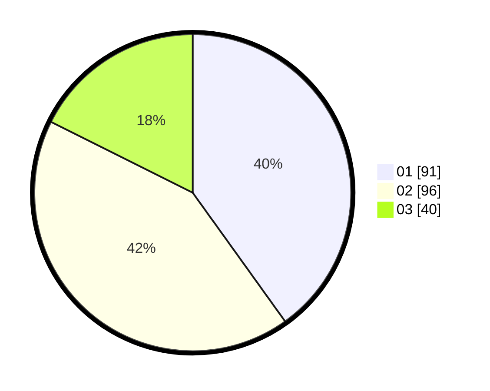

# Hasil

Hasil perolehan suara paslon dapat dilihat pada file paslon-01.txt, paslon-02.txt, dan paslon-03.txt.

Jika tidak ada, artinya data tersebut belum ada pada SIREKAP.

## Perolehan Suara

 * Paslon 01: **91**.
 * Paslon 02: **96**.
 * Paslon 03: **40**.

## Foto C Plano

https://sirekap-obj-formc.kpu.go.id/4563/pemilu/ppwp/31/73/08/10/02/3173081002003-20240215-054324--1dc9b6ec-22ff-48f9-ab71-fa9ab4593b4d.jpg

https://sirekap-obj-formc.kpu.go.id/4563/pemilu/ppwp/31/73/08/10/02/3173081002003-20240215-054235--1b7e7326-1255-4373-bed1-7d8852ec00b5.jpg
