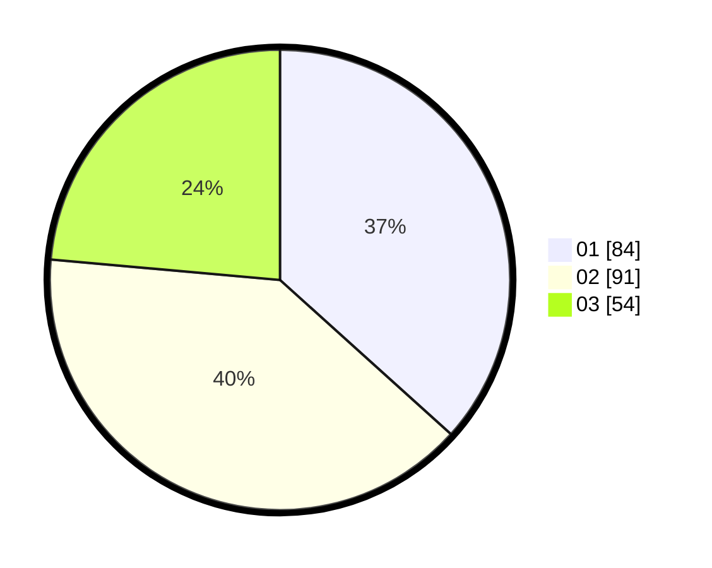

# Hasil

Hasil perolehan suara paslon dapat dilihat pada file paslon-01.txt, paslon-02.txt, dan paslon-03.txt.

Jika tidak ada, artinya data tersebut belum ada pada SIREKAP.

## Perolehan Suara

 * Paslon 01: **84**.
 * Paslon 02: **91**.
 * Paslon 03: **54**.

## Foto C Plano

https://sirekap-obj-formc.kpu.go.id/eede/pemilu/ppwp/31/73/08/10/02/3173081002005-20240214-202428--c4908f9a-6ad2-4e9b-ba02-e4896d416923.jpg

https://sirekap-obj-formc.kpu.go.id/eede/pemilu/ppwp/31/73/08/10/02/3173081002005-20240214-205621--38804558-af18-4f2f-be7d-736c245dfbc4.jpg

https://sirekap-obj-formc.kpu.go.id/eede/pemilu/ppwp/31/73/08/10/02/3173081002005-20240214-193237--1d904977-1ab3-4508-8070-30b7858ee998.jpg

## DATA PEMILIH TETAP

Jumlah pemilih dalam DPT: **281**.
 * L: **139**.
 * P: **142**.

## DATA PENGGUNA HAK PILIH

Jumlah pengguna hak pilih dalam DPT: **224**.
 * L: **107**.
 * P: **117**.

Jumlah pengguna hak pilih dalam DPTb: **2**.
 * L: **2**.
 * P: **0**.

Jumlah pengguna hak pilih dalam DPK: **4**.
 * L: **3**.
 * P: **1**.

Jumlah pengguna hak pilih: **230**.
 * L: **112**.
 * P: **118**.

## JUMLAH SUARA SAH DAN TIDAK SAH

JUMLAH SELURUH SUARA SAH: **229**.

JUMLAH SUARA TIDAK SAH: **1**.

JUMLAH SELURUH SUARA SAH DAN SUARA TIDAK SAH: **230**.
