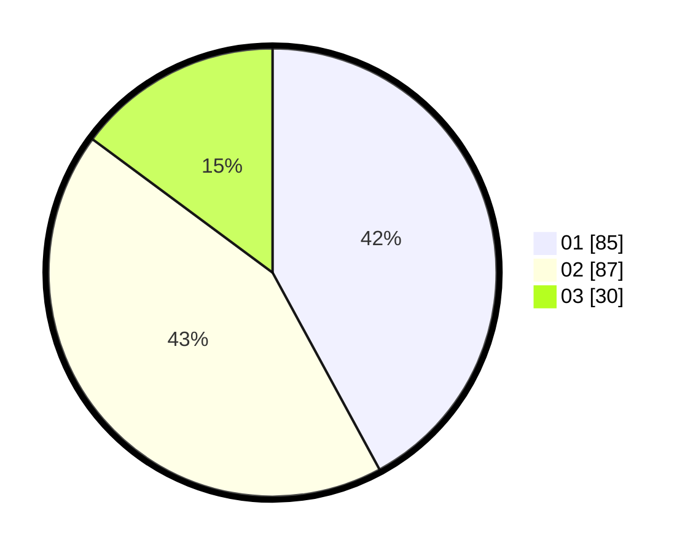

# Hasil

Hasil perolehan suara paslon dapat dilihat pada file paslon-01.txt, paslon-02.txt, dan paslon-03.txt.

Jika tidak ada, artinya data tersebut belum ada pada SIREKAP.

## Perolehan Suara

 * Paslon 01: **85**.
 * Paslon 02: **87**.
 * Paslon 03: **30**.

## Foto C Plano

https://sirekap-obj-formc.kpu.go.id/da9b/pemilu/ppwp/31/73/08/10/02/3173081002006-20240214-194820--296c5995-3ea8-444f-bf79-8e79b33b3588.jpg

https://sirekap-obj-formc.kpu.go.id/da9b/pemilu/ppwp/31/73/08/10/02/3173081002006-20240215-181543--d02f5245-1ebb-4d66-a32b-db08090c422a.jpg

https://sirekap-obj-formc.kpu.go.id/da9b/pemilu/ppwp/31/73/08/10/02/3173081002006-20240214-195029--35e6f1d8-491a-4407-8d21-7dc60c260fbf.jpg

## DATA PEMILIH TETAP

Jumlah pemilih dalam DPT: **238**.
 * L: **123**.
 * P: **115**.

## DATA PENGGUNA HAK PILIH

Jumlah pengguna hak pilih dalam DPT: **187**.
 * L: **95**.
 * P: **92**.

Jumlah pengguna hak pilih dalam DPTb: **13**.
 * L: **9**.
 * P: **4**.

Jumlah pengguna hak pilih dalam DPK: **7**.
 * L: **4**.
 * P: **3**.

Jumlah pengguna hak pilih: **207**.
 * L: **108**.
 * P: **99**.

## JUMLAH SUARA SAH DAN TIDAK SAH

JUMLAH SELURUH SUARA SAH: **202**.

JUMLAH SUARA TIDAK SAH: **5**.

JUMLAH SELURUH SUARA SAH DAN SUARA TIDAK SAH: **207**.
