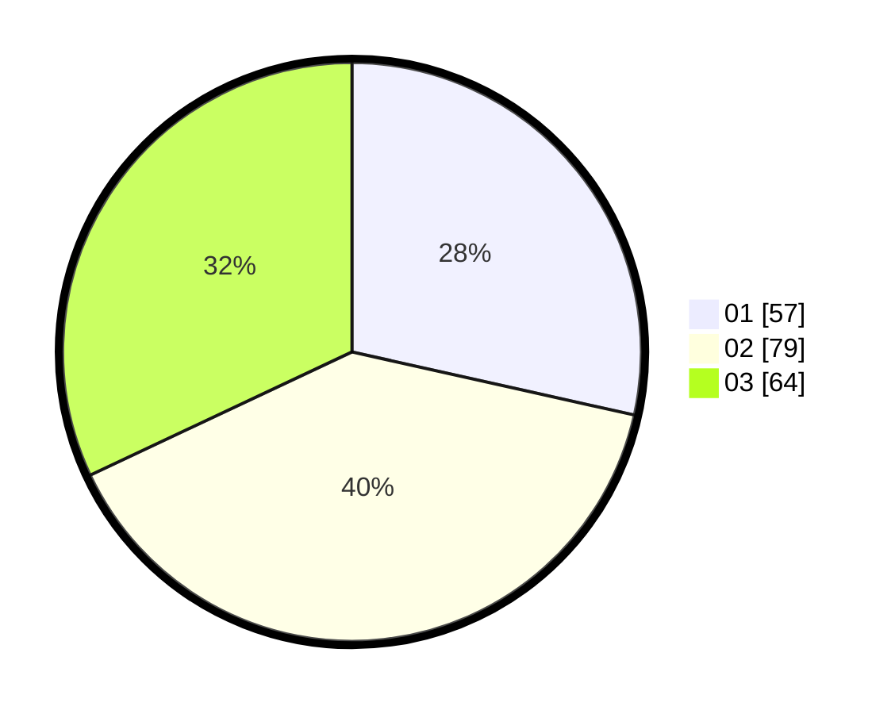

# Hasil

Hasil perolehan suara paslon dapat dilihat pada file paslon-01.txt, paslon-02.txt, dan paslon-03.txt.

Jika tidak ada, artinya data tersebut belum ada pada SIREKAP.

## Perolehan Suara

 * Paslon 01: **57**.
 * Paslon 02: **79**.
 * Paslon 03: **64**.

## Foto C Plano

https://sirekap-obj-formc.kpu.go.id/77e6/pemilu/ppwp/31/73/08/10/02/3173081002007-20240214-195736--9ffa5dd8-0949-40ae-a9bd-16b0b13714ef.jpg

https://sirekap-obj-formc.kpu.go.id/77e6/pemilu/ppwp/31/73/08/10/02/3173081002007-20240214-211857--79b1b5d5-e9e5-49aa-8c83-84f9254ba29c.jpg

https://sirekap-obj-formc.kpu.go.id/77e6/pemilu/ppwp/31/73/08/10/02/3173081002007-20240214-212100--7eb66a69-002f-4415-a92b-ac3228e5adc8.jpg

## DATA PEMILIH TETAP

Jumlah pemilih dalam DPT: **272**.
 * L: **134**.
 * P: **138**.

## DATA PENGGUNA HAK PILIH

Jumlah pengguna hak pilih dalam DPT: **192**.
 * L: **89**.
 * P: **103**.

Jumlah pengguna hak pilih dalam DPTb: **2**.
 * L: **0**.
 * P: **2**.

Jumlah pengguna hak pilih dalam DPK: **8**.
 * L: **6**.
 * P: **2**.

Jumlah pengguna hak pilih: **202**.
 * L: **95**.
 * P: **107**.

## JUMLAH SUARA SAH DAN TIDAK SAH

JUMLAH SELURUH SUARA SAH: **200**.

JUMLAH SUARA TIDAK SAH: **2**.

JUMLAH SELURUH SUARA SAH DAN SUARA TIDAK SAH: **202**.
