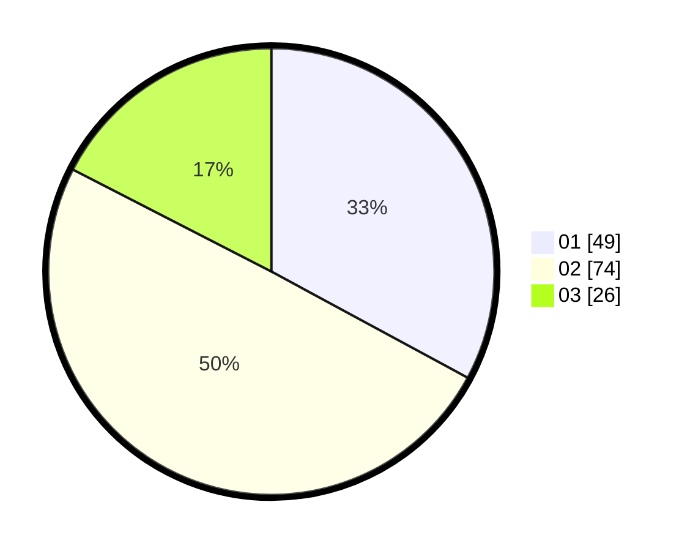

# Hasil

Hasil perolehan suara paslon dapat dilihat pada file paslon-01.txt, paslon-02.txt, dan paslon-03.txt.

Jika tidak ada, artinya data tersebut belum ada pada SIREKAP.

## Perolehan Suara

 * Paslon 01: **49**.
 * Paslon 02: **74**.
 * Paslon 03: **26**.

## Foto C Plano

https://sirekap-obj-formc.kpu.go.id/8a93/pemilu/ppwp/31/73/08/10/02/3173081002009-20240216-005237--a14b3ddb-6c34-463b-8244-2853dd3a6f3d.jpg

https://sirekap-obj-formc.kpu.go.id/8a93/pemilu/ppwp/31/73/08/10/02/3173081002009-20240216-005239--b2990da1-32e1-4e38-a19a-c795f4951cdf.jpg

https://sirekap-obj-formc.kpu.go.id/8a93/pemilu/ppwp/31/73/08/10/02/3173081002009-20240216-005239--e7636425-f9e6-4dad-ae69-814291510988.jpg

## DATA PEMILIH TETAP

Jumlah pemilih dalam DPT: **195**.
 * L: **97**.
 * P: **98**.

## DATA PENGGUNA HAK PILIH

Jumlah pengguna hak pilih dalam DPT: **143**.
 * L: **70**.
 * P: **73**.

Jumlah pengguna hak pilih dalam DPTb: **1**.
 * L: **0**.
 * P: **1**.

Jumlah pengguna hak pilih dalam DPK: **6**.
 * L: **4**.
 * P: **2**.

Jumlah pengguna hak pilih: **150**.
 * L: **74**.
 * P: **76**.

## JUMLAH SUARA SAH DAN TIDAK SAH

JUMLAH SELURUH SUARA SAH: **149**.

JUMLAH SUARA TIDAK SAH: **1**.

JUMLAH SELURUH SUARA SAH DAN SUARA TIDAK SAH: **150**.
