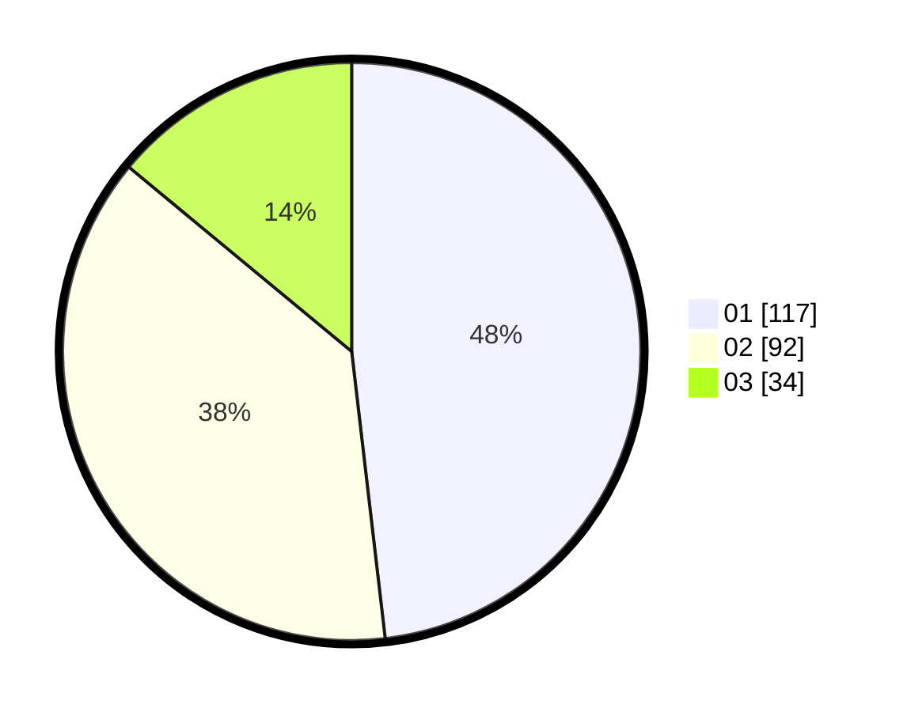

# Hasil

Hasil perolehan suara paslon dapat dilihat pada file paslon-01.txt, paslon-02.txt, dan paslon-03.txt.

Jika tidak ada, artinya data tersebut belum ada pada SIREKAP.

## Perolehan Suara

 * Paslon 01: **117**.
 * Paslon 02: **92**.
 * Paslon 03: **34**.

## Foto C Plano

https://sirekap-obj-formc.kpu.go.id/222a/pemilu/ppwp/31/73/08/10/02/3173081002012-20240216-224820--a9a40c4a-70fa-4a9e-874d-174fec590087.jpg

https://sirekap-obj-formc.kpu.go.id/222a/pemilu/ppwp/31/73/08/10/02/3173081002012-20240216-224821--23594229-be0e-47b6-87ee-a5414fb4d4e0.jpg

https://sirekap-obj-formc.kpu.go.id/222a/pemilu/ppwp/31/73/08/10/02/3173081002012-20240216-224820--6dab3e05-7fd1-489a-85a7-8d32f2b36550.jpg

## DATA PEMILIH TETAP

Jumlah pemilih dalam DPT: **270**.
 * L: **135**.
 * P: **135**.

## DATA PENGGUNA HAK PILIH

Jumlah pengguna hak pilih dalam DPT: **228**.
 * L: **108**.
 * P: **120**.

Jumlah pengguna hak pilih dalam DPTb: **15**.
 * L: **7**.
 * P: **8**.

Jumlah pengguna hak pilih dalam DPK: **0**.
 * L: **0**.
 * P: **0**.

Jumlah pengguna hak pilih: **243**.
 * L: **115**.
 * P: **128**.

## JUMLAH SUARA SAH DAN TIDAK SAH

JUMLAH SELURUH SUARA SAH: **243**.

JUMLAH SUARA TIDAK SAH: **0**.

JUMLAH SELURUH SUARA SAH DAN SUARA TIDAK SAH: **243**.
