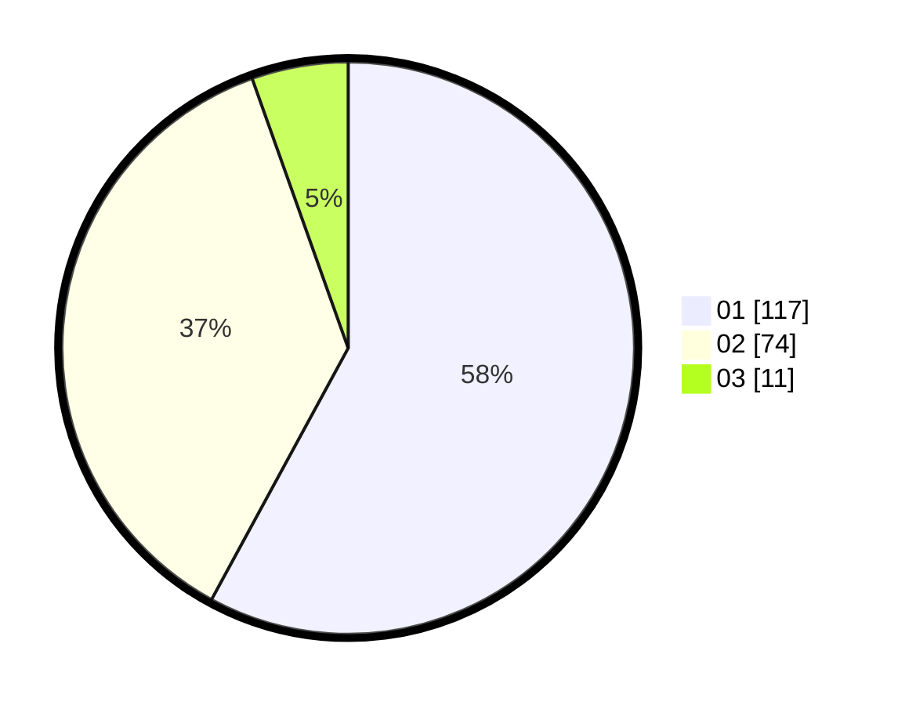

# Hasil

Hasil perolehan suara paslon dapat dilihat pada file paslon-01.txt, paslon-02.txt, dan paslon-03.txt.

Jika tidak ada, artinya data tersebut belum ada pada SIREKAP.

## Perolehan Suara

 * Paslon 01: **117**.
 * Paslon 02: **74**.
 * Paslon 03: **11**.

## Foto C Plano

https://sirekap-obj-formc.kpu.go.id/98d6/pemilu/ppwp/31/73/08/10/02/3173081002016-20240215-083209--b6340473-f370-49af-b66c-0f77680a4db9.jpg

https://sirekap-obj-formc.kpu.go.id/98d6/pemilu/ppwp/31/73/08/10/02/3173081002016-20240216-182149--650ff53b-caa1-4142-93c5-6e4df82298f5.jpg

https://sirekap-obj-formc.kpu.go.id/98d6/pemilu/ppwp/31/73/08/10/02/3173081002016-20240216-182406--36f64aef-0a3d-4d07-9a66-62b9b9814e9d.jpg

## DATA PEMILIH TETAP

Jumlah pemilih dalam DPT: **230**.
 * L: **117**.
 * P: **113**.

## DATA PENGGUNA HAK PILIH

Jumlah pengguna hak pilih dalam DPT: **201**.
 * L: **97**.
 * P: **104**.

Jumlah pengguna hak pilih dalam DPTb: **2**.
 * L: **0**.
 * P: **2**.

Jumlah pengguna hak pilih dalam DPK: **0**.
 * L: **0**.
 * P: **0**.

Jumlah pengguna hak pilih: **203**.
 * L: **97**.
 * P: **106**.

## JUMLAH SUARA SAH DAN TIDAK SAH

JUMLAH SELURUH SUARA SAH: **202**.

JUMLAH SUARA TIDAK SAH: **1**.

JUMLAH SELURUH SUARA SAH DAN SUARA TIDAK SAH: **203**.
