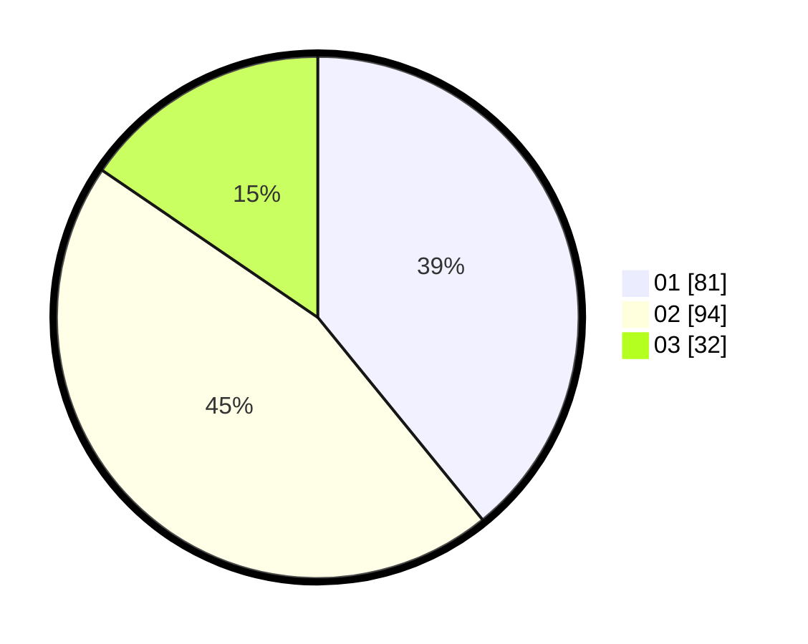

# Hasil

Hasil perolehan suara paslon dapat dilihat pada file paslon-01.txt, paslon-02.txt, dan paslon-03.txt.

Jika tidak ada, artinya data tersebut belum ada pada SIREKAP.

## Perolehan Suara

 * Paslon 01: **81**.
 * Paslon 02: **94**.
 * Paslon 03: **32**.

## Foto C Plano

https://sirekap-obj-formc.kpu.go.id/c43e/pemilu/ppwp/31/73/08/10/02/3173081002019-20240214-204148--7b612e5a-74dd-4103-b970-ff39132a1bd7.jpg

https://sirekap-obj-formc.kpu.go.id/c43e/pemilu/ppwp/31/73/08/10/02/3173081002019-20240214-213835--4c470b92-0044-4b10-ae11-4a816062a275.jpg

https://sirekap-obj-formc.kpu.go.id/c43e/pemilu/ppwp/31/73/08/10/02/3173081002019-20240214-211922--119cb83f-d1fd-4a9a-a17a-dea25f89e453.jpg
