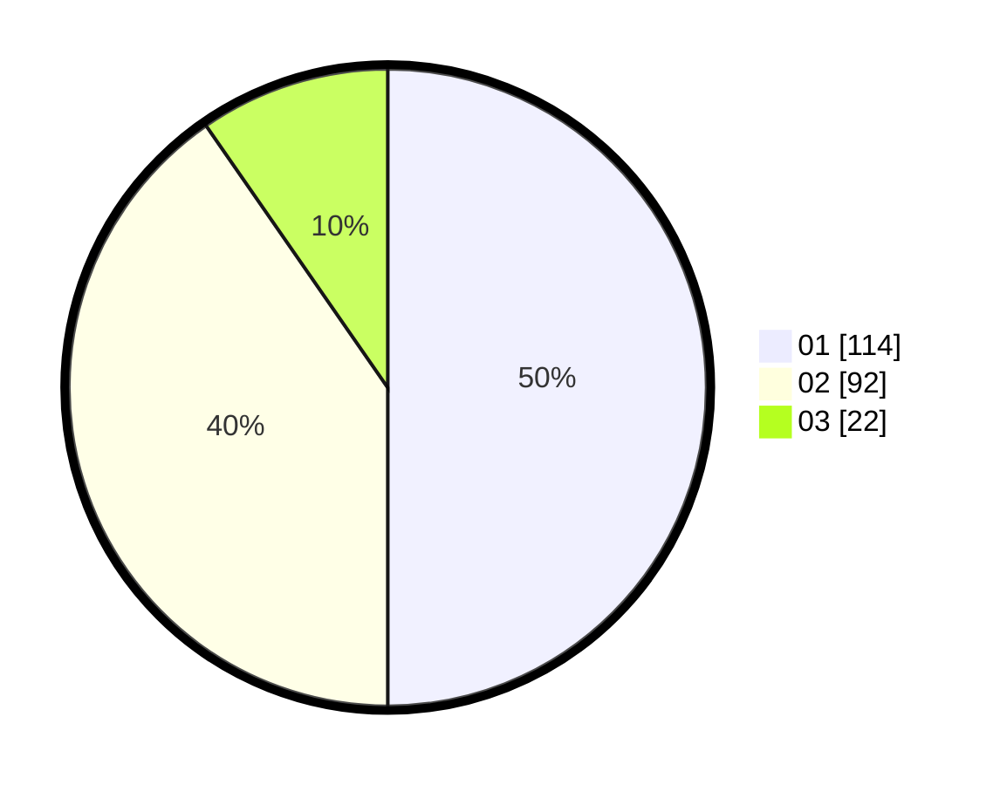

# Hasil

Hasil perolehan suara paslon dapat dilihat pada file paslon-01.txt, paslon-02.txt, dan paslon-03.txt.

Jika tidak ada, artinya data tersebut belum ada pada SIREKAP.

## Perolehan Suara

 * Paslon 01: **114**.
 * Paslon 02: **92**.
 * Paslon 03: **22**.

## Foto C Plano

https://sirekap-obj-formc.kpu.go.id/c648/pemilu/ppwp/31/73/08/10/02/3173081002021-20240215-000620--3db94da1-b87e-474d-9771-7f737ea946ca.jpg

https://sirekap-obj-formc.kpu.go.id/c648/pemilu/ppwp/31/73/08/10/02/3173081002021-20240215-000822--f7dcf1c6-da84-49a1-b45c-7e608b4636f5.jpg

https://sirekap-obj-formc.kpu.go.id/c648/pemilu/ppwp/31/73/08/10/02/3173081002021-20240215-000936--f77dff3e-c441-4144-98b8-41cbe6bb3327.jpg
