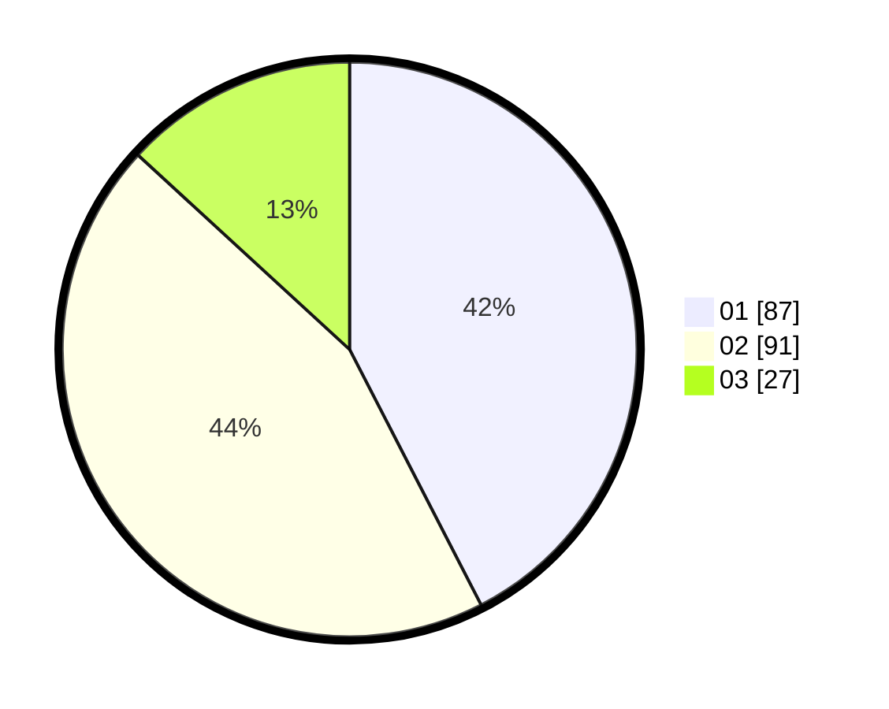

# Hasil

Hasil perolehan suara paslon dapat dilihat pada file paslon-01.txt, paslon-02.txt, dan paslon-03.txt.

Jika tidak ada, artinya data tersebut belum ada pada SIREKAP.

## Perolehan Suara

 * Paslon 01: **87**.
 * Paslon 02: **91**.
 * Paslon 03: **27**.

## Foto C Plano

https://sirekap-obj-formc.kpu.go.id/231a/pemilu/ppwp/31/73/08/10/02/3173081002025-20240214-202920--7fab1c6c-1ef3-4ed6-962e-bb6738ecddcf.jpg

https://sirekap-obj-formc.kpu.go.id/231a/pemilu/ppwp/31/73/08/10/02/3173081002025-20240214-192059--075c9cc4-d10b-4188-95ab-c3910781275c.jpg

https://sirekap-obj-formc.kpu.go.id/231a/pemilu/ppwp/31/73/08/10/02/3173081002025-20240214-192105--380ed6a7-0c78-47ef-b685-557895a9b223.jpg
