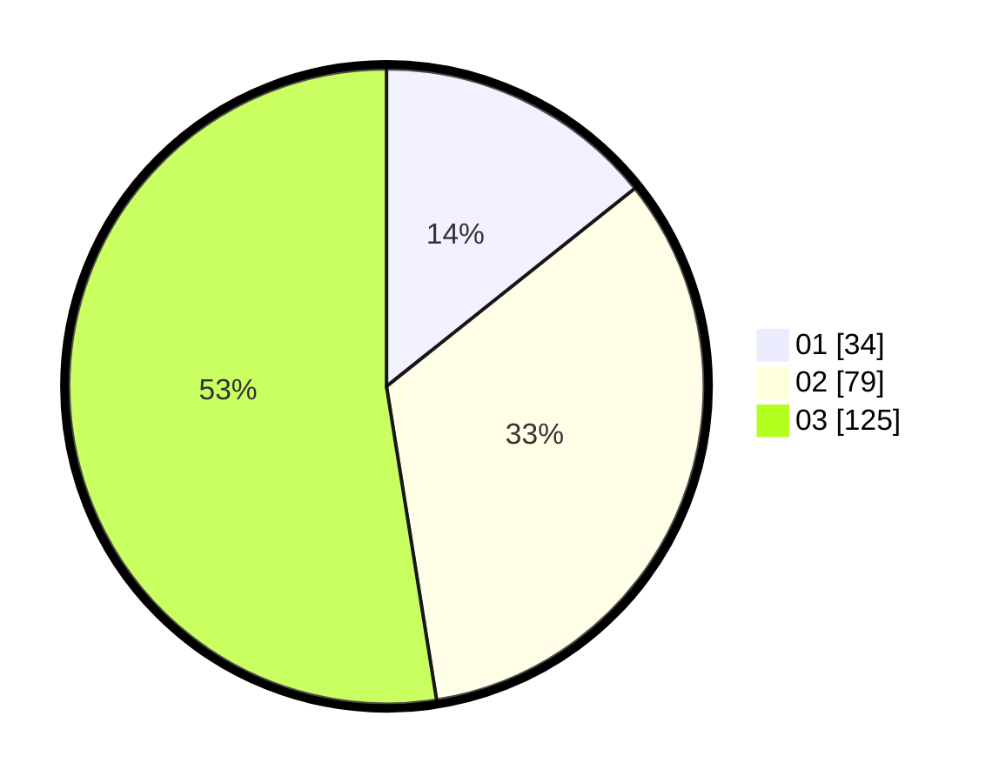

# Hasil

Hasil perolehan suara paslon dapat dilihat pada file paslon-01.txt, paslon-02.txt, dan paslon-03.txt.

Jika tidak ada, artinya data tersebut belum ada pada SIREKAP.

## Perolehan Suara

 * Paslon 01: **34**.
 * Paslon 02: **79**.
 * Paslon 03: **125**.

## Foto C Plano

https://sirekap-obj-formc.kpu.go.id/2215/pemilu/ppwp/31/73/08/10/02/3173081002026-20240214-192346--34e367a8-cee9-4b3e-89b0-c2a6e34832b5.jpg

https://sirekap-obj-formc.kpu.go.id/2215/pemilu/ppwp/31/73/08/10/02/3173081002026-20240214-191016--f1bfba16-3351-44ed-91a0-5a979875f8cd.jpg

https://sirekap-obj-formc.kpu.go.id/2215/pemilu/ppwp/31/73/08/10/02/3173081002026-20240214-203211--38cc507f-567d-4ec3-a361-200c782f71cc.jpg

## DATA PEMILIH TETAP

Jumlah pemilih dalam DPT: **295**.
 * L: **143**.
 * P: **152**.

## DATA PENGGUNA HAK PILIH

Jumlah pengguna hak pilih dalam DPT: **233**.
 * L: **114**.
 * P: **119**.

Jumlah pengguna hak pilih dalam DPTb: **8**.
 * L: **4**.
 * P: **4**.

Jumlah pengguna hak pilih dalam DPK: **3**.
 * L: **1**.
 * P: **2**.

Jumlah pengguna hak pilih: **244**.
 * L: **119**.
 * P: **125**.

## JUMLAH SUARA SAH DAN TIDAK SAH

JUMLAH SELURUH SUARA SAH: **238**.

JUMLAH SUARA TIDAK SAH: **6**.

JUMLAH SELURUH SUARA SAH DAN SUARA TIDAK SAH: **244**.
