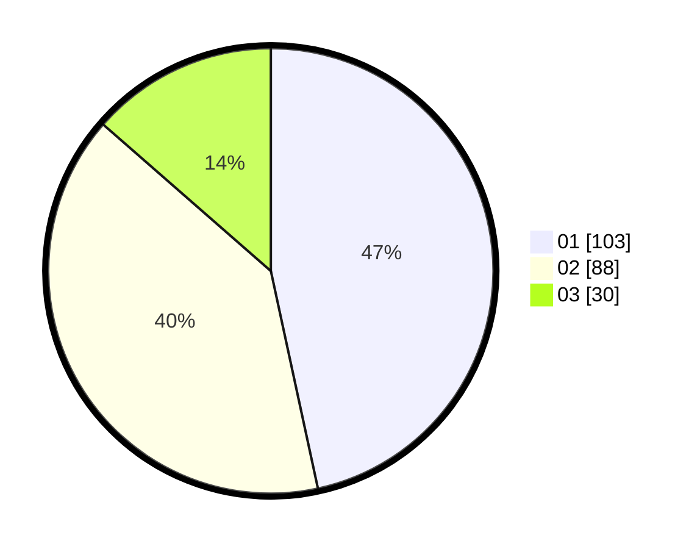

# Hasil

Hasil perolehan suara paslon dapat dilihat pada file paslon-01.txt, paslon-02.txt, dan paslon-03.txt.

Jika tidak ada, artinya data tersebut belum ada pada SIREKAP.

## Perolehan Suara

 * Paslon 01: **103**.
 * Paslon 02: **88**.
 * Paslon 03: **30**.

## Foto C Plano

https://sirekap-obj-formc.kpu.go.id/32aa/pemilu/ppwp/31/73/08/10/02/3173081002027-20240214-225816--e019ec00-ca63-4989-ac70-04897814f50f.jpg

https://sirekap-obj-formc.kpu.go.id/32aa/pemilu/ppwp/31/73/08/10/02/3173081002027-20240214-225856--e5d98900-e495-403d-9053-2aa7a4ab62a0.jpg

https://sirekap-obj-formc.kpu.go.id/32aa/pemilu/ppwp/31/73/08/10/02/3173081002027-20240214-225937--f2aee834-68dc-4c07-9a93-930441b43cdf.jpg

## DATA PEMILIH TETAP

Jumlah pemilih dalam DPT: **290**.
 * L: **141**.
 * P: **149**.

## DATA PENGGUNA HAK PILIH

Jumlah pengguna hak pilih dalam DPT: **209**.
 * L: **104**.
 * P: **105**.

Jumlah pengguna hak pilih dalam DPTb: **7**.
 * L: **1**.
 * P: **6**.

Jumlah pengguna hak pilih dalam DPK: **5**.
 * L: **3**.
 * P: **2**.

Jumlah pengguna hak pilih: **221**.
 * L: **108**.
 * P: **113**.

## JUMLAH SUARA SAH DAN TIDAK SAH

JUMLAH SELURUH SUARA SAH: **221**.

JUMLAH SUARA TIDAK SAH: **0**.

JUMLAH SELURUH SUARA SAH DAN SUARA TIDAK SAH: **221**.
