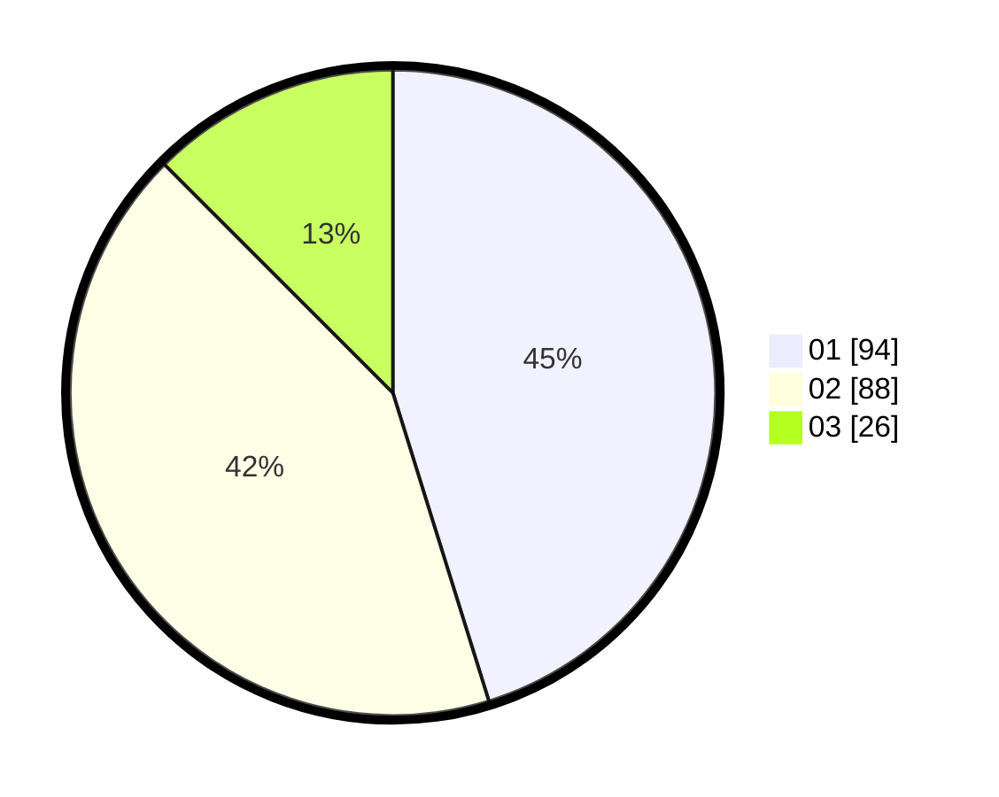

# Hasil

Hasil perolehan suara paslon dapat dilihat pada file paslon-01.txt, paslon-02.txt, dan paslon-03.txt.

Jika tidak ada, artinya data tersebut belum ada pada SIREKAP.

## Perolehan Suara

 * Paslon 01: **94**.
 * Paslon 02: **88**.
 * Paslon 03: **26**.

## Foto C Plano

https://sirekap-obj-formc.kpu.go.id/146c/pemilu/ppwp/31/73/08/10/02/3173081002029-20240215-234631--97659cd7-4847-4c52-92f0-4a80558dc12f.jpg

https://sirekap-obj-formc.kpu.go.id/146c/pemilu/ppwp/31/73/08/10/02/3173081002029-20240215-234634--e40d8e57-3840-4b8e-bee0-8e04a97ed508.jpg

https://sirekap-obj-formc.kpu.go.id/146c/pemilu/ppwp/31/73/08/10/02/3173081002029-20240215-234633--5e4d7099-b85e-4e1f-bc5e-6120d58c1b53.jpg

## DATA PEMILIH TETAP

Jumlah pemilih dalam DPT: **296**.
 * L: **144**.
 * P: **152**.

## DATA PENGGUNA HAK PILIH

Jumlah pengguna hak pilih dalam DPT: **296**.
 * L: **144**.
 * P: **152**.

Jumlah pengguna hak pilih dalam DPTb: **2**.
 * L: **2**.
 * P: **0**.

Jumlah pengguna hak pilih dalam DPK: **0**.
 * L: **0**.
 * P: **0**.

Jumlah pengguna hak pilih: **298**.
 * L: **146**.
 * P: **152**.

## JUMLAH SUARA SAH DAN TIDAK SAH

JUMLAH SELURUH SUARA SAH: **208**.

JUMLAH SUARA TIDAK SAH: **3**.

JUMLAH SELURUH SUARA SAH DAN SUARA TIDAK SAH: **211**.
