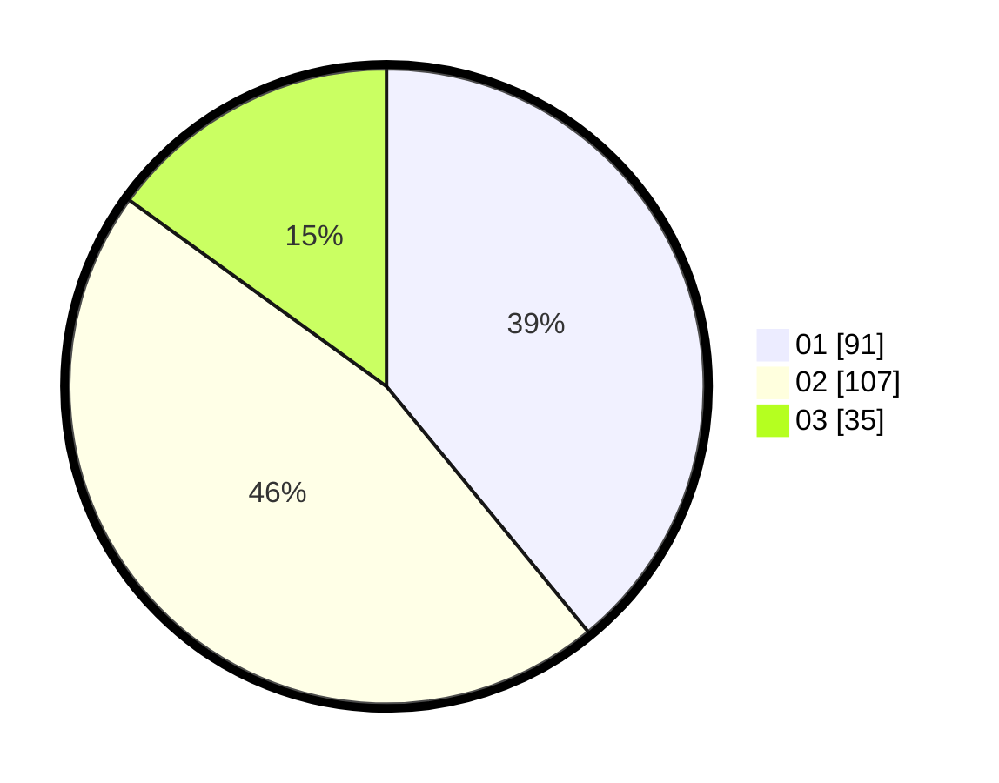

# Hasil

Hasil perolehan suara paslon dapat dilihat pada file paslon-01.txt, paslon-02.txt, dan paslon-03.txt.

Jika tidak ada, artinya data tersebut belum ada pada SIREKAP.

## Perolehan Suara

 * Paslon 01: **91**.
 * Paslon 02: **107**.
 * Paslon 03: **35**.

## Foto C Plano

https://sirekap-obj-formc.kpu.go.id/56d3/pemilu/ppwp/31/73/08/10/02/3173081002030-20240214-201157--f74f4259-c4a3-4229-b220-b9daf58db61d.jpg

https://sirekap-obj-formc.kpu.go.id/56d3/pemilu/ppwp/31/73/08/10/02/3173081002030-20240214-201219--62a3826b-83fe-450f-bb0c-8848a3b71ba4.jpg

https://sirekap-obj-formc.kpu.go.id/56d3/pemilu/ppwp/31/73/08/10/02/3173081002030-20240214-201225--14a6ddeb-16f7-4d58-b0ff-f767e29ac85f.jpg

## DATA PEMILIH TETAP

Jumlah pemilih dalam DPT: **297**.
 * L: **137**.
 * P: **160**.

## DATA PENGGUNA HAK PILIH

Jumlah pengguna hak pilih dalam DPT: **219**.
 * L: **99**.
 * P: **120**.

Jumlah pengguna hak pilih dalam DPTb: **13**.
 * L: **6**.
 * P: **7**.

Jumlah pengguna hak pilih dalam DPK: **4**.
 * L: **2**.
 * P: **2**.

Jumlah pengguna hak pilih: **236**.
 * L: **107**.
 * P: **129**.

## JUMLAH SUARA SAH DAN TIDAK SAH

JUMLAH SELURUH SUARA SAH: **233**.

JUMLAH SUARA TIDAK SAH: **3**.

JUMLAH SELURUH SUARA SAH DAN SUARA TIDAK SAH: **236**.
