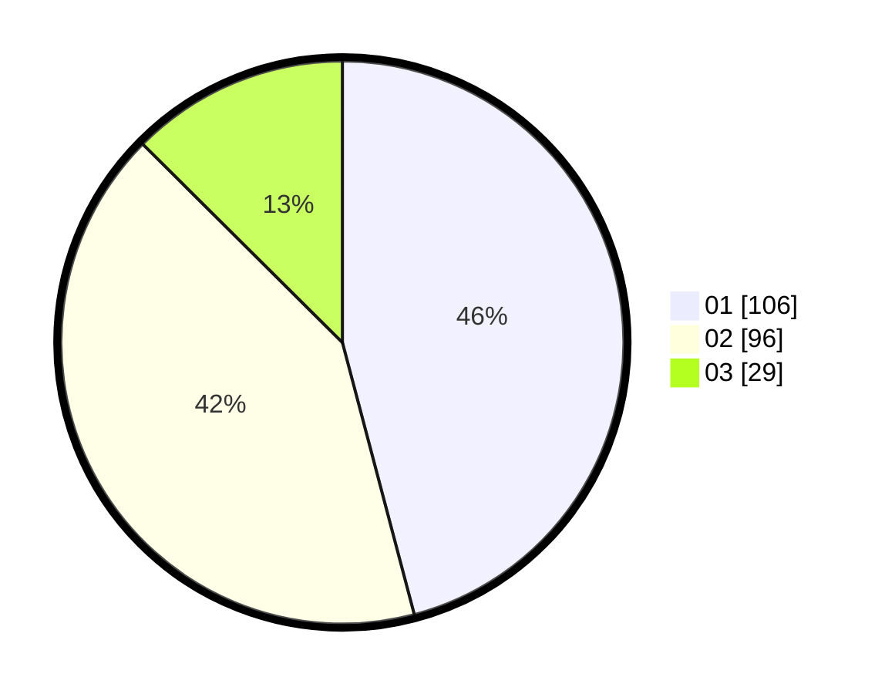

# Hasil

Hasil perolehan suara paslon dapat dilihat pada file paslon-01.txt, paslon-02.txt, dan paslon-03.txt.

Jika tidak ada, artinya data tersebut belum ada pada SIREKAP.

## Perolehan Suara

 * Paslon 01: **106**.
 * Paslon 02: **96**.
 * Paslon 03: **29**.

## Foto C Plano

https://sirekap-obj-formc.kpu.go.id/f88f/pemilu/ppwp/31/73/08/10/02/3173081002034-20240214-195050--c43afc77-9fce-41fa-a0a5-47e641d661a4.jpg

https://sirekap-obj-formc.kpu.go.id/f88f/pemilu/ppwp/31/73/08/10/02/3173081002034-20240214-194131--c60a89ee-bea4-49a8-8fe4-323f888c6b97.jpg

https://sirekap-obj-formc.kpu.go.id/f88f/pemilu/ppwp/31/73/08/10/02/3173081002034-20240214-194548--b33c7baf-748a-43ee-86ef-801eebeca210.jpg
