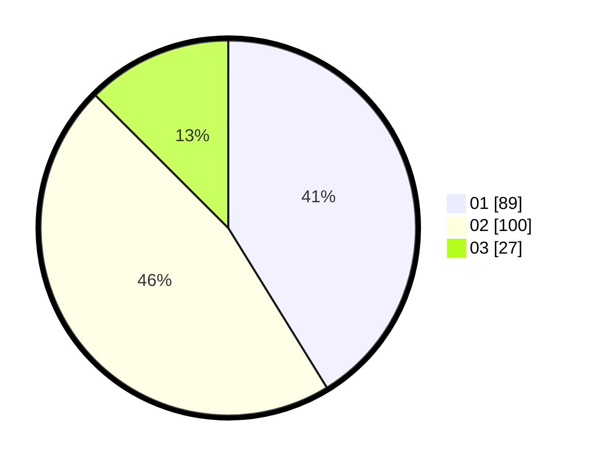

# Hasil

Hasil perolehan suara paslon dapat dilihat pada file paslon-01.txt, paslon-02.txt, dan paslon-03.txt.

Jika tidak ada, artinya data tersebut belum ada pada SIREKAP.

## Perolehan Suara

 * Paslon 01: **89**.
 * Paslon 02: **100**.
 * Paslon 03: **27**.

## Foto C Plano

https://sirekap-obj-formc.kpu.go.id/9652/pemilu/ppwp/31/73/08/10/02/3173081002037-20240214-205715--36b89824-a9cf-4e2c-9a9c-33872944571b.jpg

https://sirekap-obj-formc.kpu.go.id/9652/pemilu/ppwp/31/73/08/10/02/3173081002037-20240214-212954--6507c177-cf9c-4a2e-a2b2-b33d16696ce1.jpg

https://sirekap-obj-formc.kpu.go.id/9652/pemilu/ppwp/31/73/08/10/02/3173081002037-20240214-213046--1b53ccd6-d3ff-498b-bceb-44faa1950047.jpg
