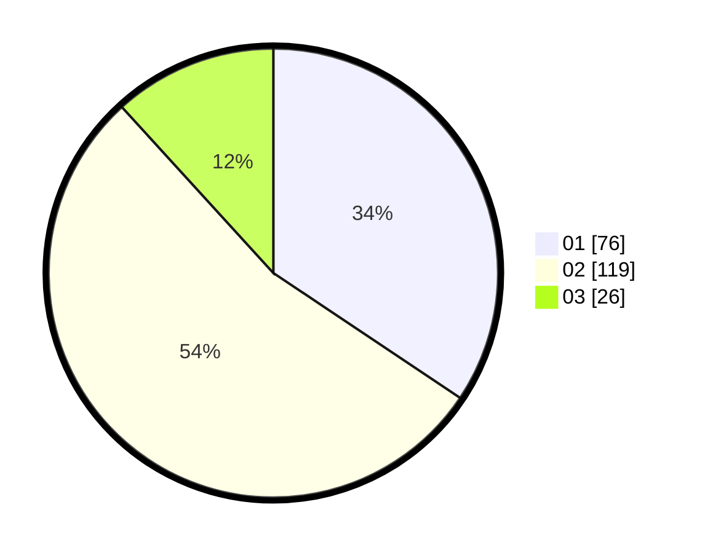

# Hasil

Hasil perolehan suara paslon dapat dilihat pada file paslon-01.txt, paslon-02.txt, dan paslon-03.txt.

Jika tidak ada, artinya data tersebut belum ada pada SIREKAP.

## Perolehan Suara

 * Paslon 01: **76**.
 * Paslon 02: **119**.
 * Paslon 03: **26**.

## Foto C Plano

https://sirekap-obj-formc.kpu.go.id/5562/pemilu/ppwp/31/73/08/10/02/3173081002038-20240215-052611--8d8e9222-ebc3-4837-bc9e-d5575c71a8d9.jpg

https://sirekap-obj-formc.kpu.go.id/5562/pemilu/ppwp/31/73/08/10/02/3173081002038-20240215-052717--32664f4b-60a6-4d02-b9ab-2457d09c650e.jpg

https://sirekap-obj-formc.kpu.go.id/5562/pemilu/ppwp/31/73/08/10/02/3173081002038-20240215-052821--5796dac0-aeca-4d10-8478-ad0935c701a7.jpg
