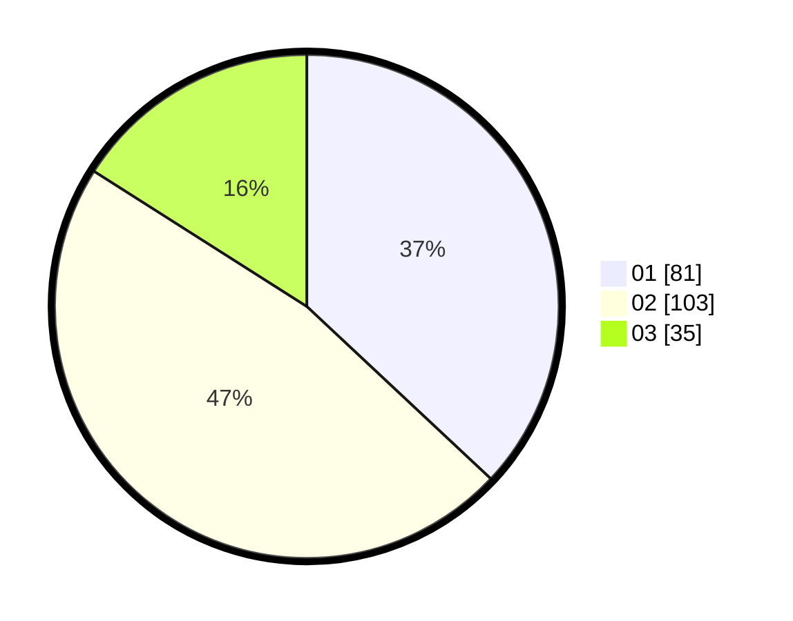

# Hasil

Hasil perolehan suara paslon dapat dilihat pada file paslon-01.txt, paslon-02.txt, dan paslon-03.txt.

Jika tidak ada, artinya data tersebut belum ada pada SIREKAP.

## Perolehan Suara

 * Paslon 01: **81**.
 * Paslon 02: **103**.
 * Paslon 03: **35**.

## Foto C Plano

https://sirekap-obj-formc.kpu.go.id/56c3/pemilu/ppwp/31/73/08/10/02/3173081002039-20240215-044748--a9203ad2-5ac3-44f4-beba-98430b53b609.jpg

https://sirekap-obj-formc.kpu.go.id/56c3/pemilu/ppwp/31/73/08/10/02/3173081002039-20240217-145936--0dbc1b04-4495-4c28-bf77-47f353b7710d.jpg

https://sirekap-obj-formc.kpu.go.id/56c3/pemilu/ppwp/31/73/08/10/02/3173081002039-20240215-051517--26e4f44e-3e3c-4cbc-8f65-22b06b1b477c.jpg
