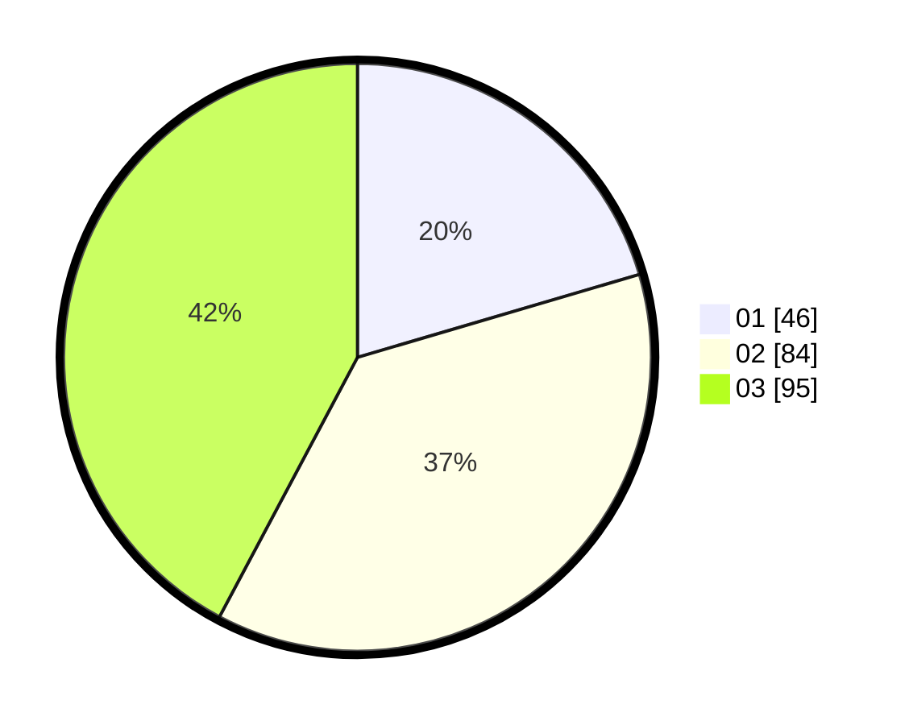

# Hasil

Hasil perolehan suara paslon dapat dilihat pada file paslon-01.txt, paslon-02.txt, dan paslon-03.txt.

Jika tidak ada, artinya data tersebut belum ada pada SIREKAP.

## Perolehan Suara

 * Paslon 01: **46**.
 * Paslon 02: **84**.
 * Paslon 03: **95**.

## Foto C Plano

https://sirekap-obj-formc.kpu.go.id/f96e/pemilu/ppwp/31/73/08/10/02/3173081002046-20240216-152947--3d25f768-6ce6-4192-849c-8ea461451714.jpg

https://sirekap-obj-formc.kpu.go.id/f96e/pemilu/ppwp/31/73/08/10/02/3173081002046-20240216-152948--463ad3db-2939-418a-8fd0-5fb879b51732.jpg

https://sirekap-obj-formc.kpu.go.id/f96e/pemilu/ppwp/31/73/08/10/02/3173081002046-20240216-152947--c58e1093-493d-43ae-8b09-9bb6ed4ee18c.jpg

## DATA PEMILIH TETAP

Jumlah pemilih dalam DPT: **278**.
 * L: **132**.
 * P: **146**.

## DATA PENGGUNA HAK PILIH

Jumlah pengguna hak pilih dalam DPT: **213**.
 * L: **100**.
 * P: **113**.

Jumlah pengguna hak pilih dalam DPTb: **7**.
 * L: **4**.
 * P: **3**.

Jumlah pengguna hak pilih dalam DPK: **7**.
 * L: **3**.
 * P: **4**.

Jumlah pengguna hak pilih: **227**.
 * L: **107**.
 * P: **120**.

## JUMLAH SUARA SAH DAN TIDAK SAH

JUMLAH SELURUH SUARA SAH: **225**.

JUMLAH SUARA TIDAK SAH: **2**.

JUMLAH SELURUH SUARA SAH DAN SUARA TIDAK SAH: **227**.
