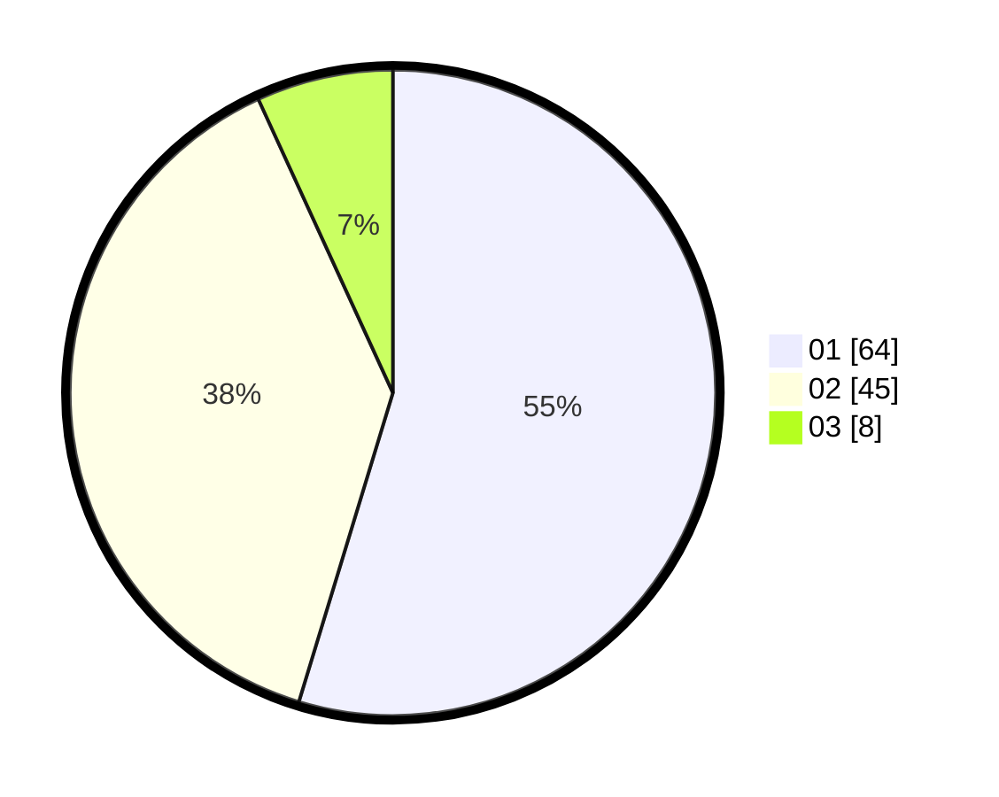

# Hasil

Hasil perolehan suara paslon dapat dilihat pada file paslon-01.txt, paslon-02.txt, dan paslon-03.txt.

Jika tidak ada, artinya data tersebut belum ada pada SIREKAP.

## Perolehan Suara

 * Paslon 01: **64**.
 * Paslon 02: **45**.
 * Paslon 03: **8**.

## Foto C Plano

https://sirekap-obj-formc.kpu.go.id/cc6b/pemilu/ppwp/31/73/08/10/02/3173081002049-20240215-111402--adf410ec-cc77-4e43-b560-59f1ffea5828.jpg

https://sirekap-obj-formc.kpu.go.id/cc6b/pemilu/ppwp/31/73/08/10/02/3173081002049-20240215-111430--18649a41-8c46-4f2d-8281-fd326dfa09c6.jpg

https://sirekap-obj-formc.kpu.go.id/cc6b/pemilu/ppwp/31/73/08/10/02/3173081002049-20240215-111412--d4aeb990-c06c-4985-82b9-6a6836f659f9.jpg

## DATA PEMILIH TETAP

Jumlah pemilih dalam DPT: **151**.
 * L: **78**.
 * P: **73**.

## DATA PENGGUNA HAK PILIH

Jumlah pengguna hak pilih dalam DPT: **118**.
 * L: **59**.
 * P: **59**.

Jumlah pengguna hak pilih dalam DPTb: **0**.
 * L: **0**.
 * P: **0**.

Jumlah pengguna hak pilih dalam DPK: **0**.
 * L: **0**.
 * P: **0**.

Jumlah pengguna hak pilih: **118**.
 * L: **59**.
 * P: **59**.

## JUMLAH SUARA SAH DAN TIDAK SAH

JUMLAH SELURUH SUARA SAH: **117**.

JUMLAH SUARA TIDAK SAH: **1**.

JUMLAH SELURUH SUARA SAH DAN SUARA TIDAK SAH: **118**.
