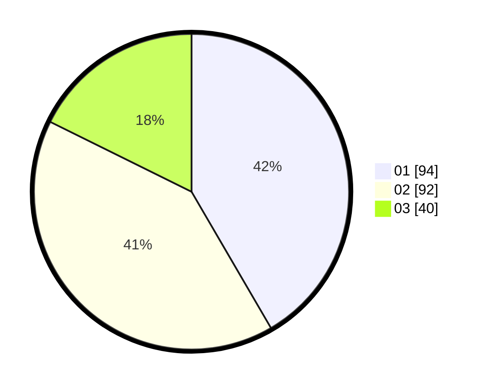

# Hasil

Hasil perolehan suara paslon dapat dilihat pada file paslon-01.txt, paslon-02.txt, dan paslon-03.txt.

Jika tidak ada, artinya data tersebut belum ada pada SIREKAP.

## Perolehan Suara

 * Paslon 01: **94**.
 * Paslon 02: **92**.
 * Paslon 03: **40**.

## Foto C Plano

https://sirekap-obj-formc.kpu.go.id/1741/pemilu/ppwp/31/73/08/10/02/3173081002050-20240214-211603--b925b382-1b71-41ac-854d-e618dc87ec75.jpg

https://sirekap-obj-formc.kpu.go.id/1741/pemilu/ppwp/31/73/08/10/02/3173081002050-20240214-211830--d619e5ce-a908-4b06-aac1-91e84f230df4.jpg

https://sirekap-obj-formc.kpu.go.id/1741/pemilu/ppwp/31/73/08/10/02/3173081002050-20240214-212227--44b71eb5-e4d2-4ecc-9282-b406feb2d79d.jpg

## DATA PEMILIH TETAP

Jumlah pemilih dalam DPT: **296**.
 * L: **159**.
 * P: **137**.

## DATA PENGGUNA HAK PILIH

Jumlah pengguna hak pilih dalam DPT: **231**.
 * L: **125**.
 * P: **106**.

Jumlah pengguna hak pilih dalam DPTb: **3**.
 * L: **2**.
 * P: **1**.

Jumlah pengguna hak pilih dalam DPK: **0**.
 * L: **0**.
 * P: **0**.

Jumlah pengguna hak pilih: **234**.
 * L: **127**.
 * P: **107**.

## JUMLAH SUARA SAH DAN TIDAK SAH

JUMLAH SELURUH SUARA SAH: **226**.

JUMLAH SUARA TIDAK SAH: **5**.

JUMLAH SELURUH SUARA SAH DAN SUARA TIDAK SAH: **231**.
