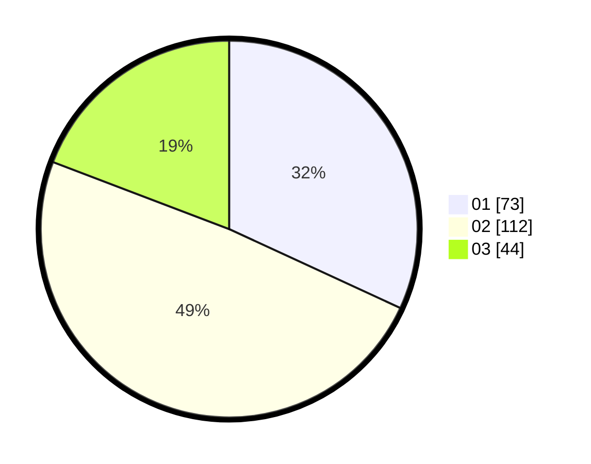

# Hasil

Hasil perolehan suara paslon dapat dilihat pada file paslon-01.txt, paslon-02.txt, dan paslon-03.txt.

Jika tidak ada, artinya data tersebut belum ada pada SIREKAP.

## Perolehan Suara

 * Paslon 01: **73**.
 * Paslon 02: **112**.
 * Paslon 03: **44**.

## Foto C Plano

https://sirekap-obj-formc.kpu.go.id/c946/pemilu/ppwp/31/73/08/10/02/3173081002051-20240214-201024--bc7236e2-50dd-4779-9161-140f10bb8235.jpg

https://sirekap-obj-formc.kpu.go.id/c946/pemilu/ppwp/31/73/08/10/02/3173081002051-20240214-200347--759bf7c1-0080-48ec-a028-ffd6074eed08.jpg

https://sirekap-obj-formc.kpu.go.id/c946/pemilu/ppwp/31/73/08/10/02/3173081002051-20240214-203917--e3baedb8-9168-44d5-838c-91e3a18483bb.jpg

## DATA PEMILIH TETAP

Jumlah pemilih dalam DPT: **295**.
 * L: **135**.
 * P: **160**.

## DATA PENGGUNA HAK PILIH

Jumlah pengguna hak pilih dalam DPT: **222**.
 * L: **95**.
 * P: **127**.

Jumlah pengguna hak pilih dalam DPTb: **7**.
 * L: **1**.
 * P: **6**.

Jumlah pengguna hak pilih dalam DPK: **1**.
 * L: **1**.
 * P: **0**.

Jumlah pengguna hak pilih: **230**.
 * L: **97**.
 * P: **133**.

## JUMLAH SUARA SAH DAN TIDAK SAH

JUMLAH SELURUH SUARA SAH: **229**.

JUMLAH SUARA TIDAK SAH: **1**.

JUMLAH SELURUH SUARA SAH DAN SUARA TIDAK SAH: **230**.
