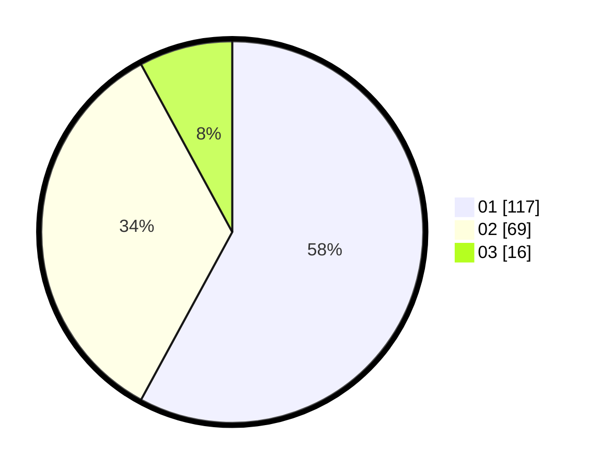

# Hasil

Hasil perolehan suara paslon dapat dilihat pada file paslon-01.txt, paslon-02.txt, dan paslon-03.txt.

Jika tidak ada, artinya data tersebut belum ada pada SIREKAP.

## Perolehan Suara

 * Paslon 01: **117**.
 * Paslon 02: **69**.
 * Paslon 03: **16**.

## Foto C Plano

https://sirekap-obj-formc.kpu.go.id/fa24/pemilu/ppwp/31/73/08/10/02/3173081002054-20240214-204644--ceeb8e71-0ad7-4f6e-9449-e6df0a4f90d1.jpg

https://sirekap-obj-formc.kpu.go.id/fa24/pemilu/ppwp/31/73/08/10/02/3173081002054-20240214-204649--4e6771f4-b102-449b-812c-375cf12bddf8.jpg

https://sirekap-obj-formc.kpu.go.id/fa24/pemilu/ppwp/31/73/08/10/02/3173081002054-20240214-204657--ac5eac11-cccc-4014-87bc-e8b0e1693a0b.jpg
