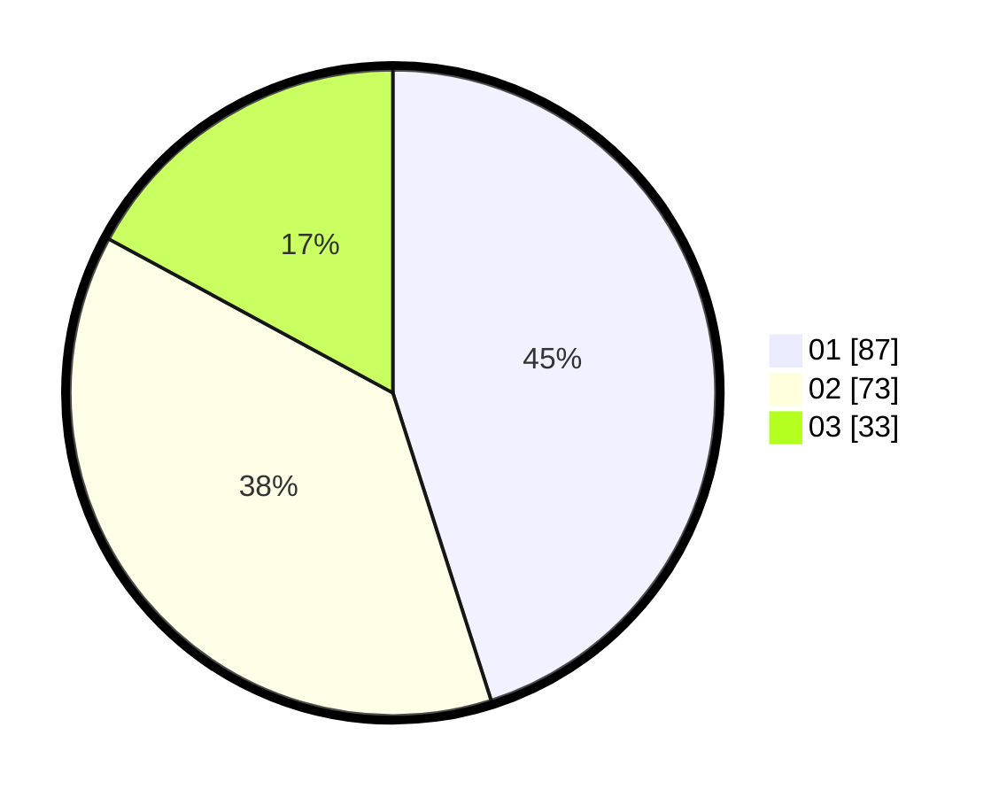

# Hasil

Hasil perolehan suara paslon dapat dilihat pada file paslon-01.txt, paslon-02.txt, dan paslon-03.txt.

Jika tidak ada, artinya data tersebut belum ada pada SIREKAP.

## Perolehan Suara

 * Paslon 01: **87**.
 * Paslon 02: **73**.
 * Paslon 03: **33**.

## Foto C Plano

https://sirekap-obj-formc.kpu.go.id/b047/pemilu/ppwp/31/73/08/10/02/3173081002056-20240214-235527--4a7d3b7d-2474-45c6-95a4-2db59f17ea50.jpg

https://sirekap-obj-formc.kpu.go.id/b047/pemilu/ppwp/31/73/08/10/02/3173081002056-20240214-211454--5da8e09e-8944-4da1-ae77-def0f8315259.jpg

https://sirekap-obj-formc.kpu.go.id/b047/pemilu/ppwp/31/73/08/10/02/3173081002056-20240214-211605--478ace35-ef94-4bd7-86cd-6e5c45ada323.jpg
