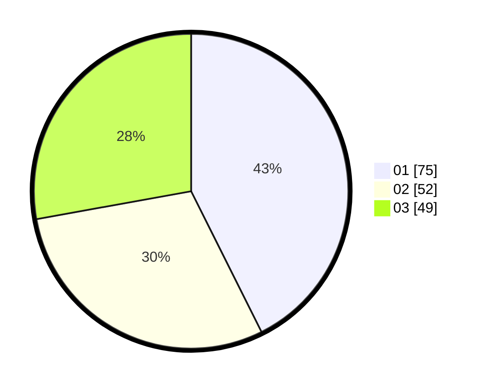

# Hasil

Hasil perolehan suara paslon dapat dilihat pada file paslon-01.txt, paslon-02.txt, dan paslon-03.txt.

Jika tidak ada, artinya data tersebut belum ada pada SIREKAP.

## Perolehan Suara

 * Paslon 01: **75**.
 * Paslon 02: **52**.
 * Paslon 03: **49**.

## Foto C Plano

https://sirekap-obj-formc.kpu.go.id/9357/pemilu/ppwp/31/73/08/10/02/3173081002059-20240214-211458--a5503c46-60b1-4fbf-8dc6-320e250b8e7d.jpg

https://sirekap-obj-formc.kpu.go.id/9357/pemilu/ppwp/31/73/08/10/02/3173081002059-20240214-211507--5f69808b-231b-491a-9080-a4fe7622c561.jpg

https://sirekap-obj-formc.kpu.go.id/9357/pemilu/ppwp/31/73/08/10/02/3173081002059-20240214-211513--b99d45de-9f48-4211-bb43-cc9cc64218cf.jpg
