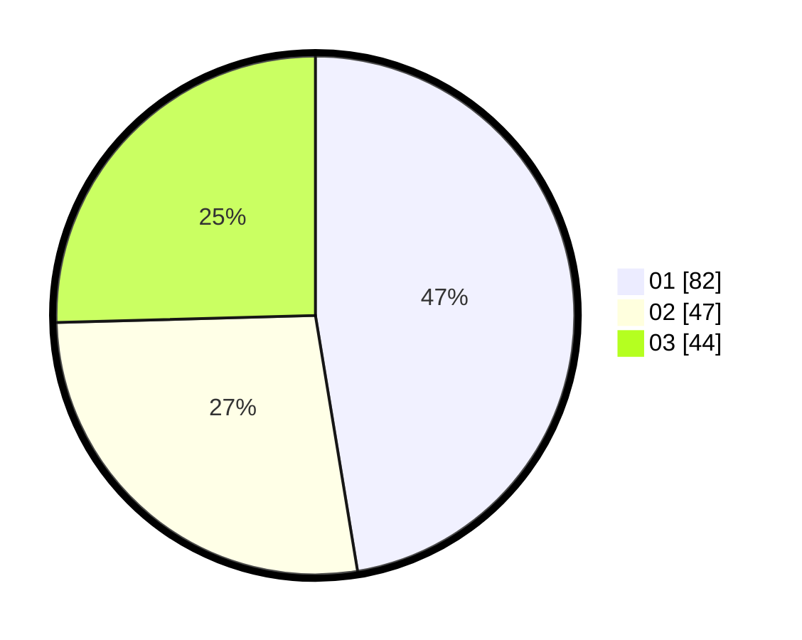

# Hasil

Hasil perolehan suara paslon dapat dilihat pada file paslon-01.txt, paslon-02.txt, dan paslon-03.txt.

Jika tidak ada, artinya data tersebut belum ada pada SIREKAP.

## Perolehan Suara

 * Paslon 01: **82**.
 * Paslon 02: **47**.
 * Paslon 03: **44**.

## Foto C Plano

https://sirekap-obj-formc.kpu.go.id/467e/pemilu/ppwp/31/73/08/10/02/3173081002060-20240216-044743--c4b51d3a-9b68-4e32-becb-0f66d3f48b9f.jpg

https://sirekap-obj-formc.kpu.go.id/467e/pemilu/ppwp/31/73/08/10/02/3173081002060-20240216-044755--aef8ced9-d0e0-4aa1-8c95-08bce73a98e5.jpg

https://sirekap-obj-formc.kpu.go.id/467e/pemilu/ppwp/31/73/08/10/02/3173081002060-20240216-044754--3faea4d5-d7ee-44b2-89ab-6c745d506d19.jpg

## DATA PEMILIH TETAP

Jumlah pemilih dalam DPT: **214**.
 * L: **100**.
 * P: **114**.

## DATA PENGGUNA HAK PILIH

Jumlah pengguna hak pilih dalam DPT: **170**.
 * L: **77**.
 * P: **93**.

Jumlah pengguna hak pilih dalam DPTb: **4**.
 * L: **1**.
 * P: **3**.

Jumlah pengguna hak pilih dalam DPK: **1**.
 * L: **1**.
 * P: **0**.

Jumlah pengguna hak pilih: **175**.
 * L: **79**.
 * P: **96**.

## JUMLAH SUARA SAH DAN TIDAK SAH

JUMLAH SELURUH SUARA SAH: **173**.

JUMLAH SUARA TIDAK SAH: **2**.

JUMLAH SELURUH SUARA SAH DAN SUARA TIDAK SAH: **175**.
