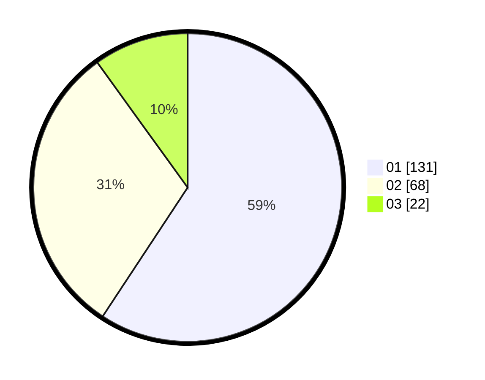

# Hasil

Hasil perolehan suara paslon dapat dilihat pada file paslon-01.txt, paslon-02.txt, dan paslon-03.txt.

Jika tidak ada, artinya data tersebut belum ada pada SIREKAP.

## Perolehan Suara

 * Paslon 01: **131**.
 * Paslon 02: **68**.
 * Paslon 03: **22**.

## Foto C Plano

https://sirekap-obj-formc.kpu.go.id/5cc1/pemilu/ppwp/31/73/08/10/02/3173081002068-20240215-040814--c68ec961-1b84-41e6-b296-358dbe0daa7c.jpg

https://sirekap-obj-formc.kpu.go.id/5cc1/pemilu/ppwp/31/73/08/10/02/3173081002068-20240215-040843--74308a94-3b77-422f-ba6e-d0a810d08fd2.jpg

https://sirekap-obj-formc.kpu.go.id/5cc1/pemilu/ppwp/31/73/08/10/02/3173081002068-20240215-040825--c064144b-e802-4e5a-bd84-325860df7374.jpg

## DATA PEMILIH TETAP

Jumlah pemilih dalam DPT: **288**.
 * L: **154**.
 * P: **134**.

## DATA PENGGUNA HAK PILIH

Jumlah pengguna hak pilih dalam DPT: **219**.
 * L: **113**.
 * P: **106**.

Jumlah pengguna hak pilih dalam DPTb: **4**.
 * L: **1**.
 * P: **3**.

Jumlah pengguna hak pilih dalam DPK: **1**.
 * L: **1**.
 * P: **0**.

Jumlah pengguna hak pilih: **224**.
 * L: **115**.
 * P: **109**.

## JUMLAH SUARA SAH DAN TIDAK SAH

JUMLAH SELURUH SUARA SAH: **221**.

JUMLAH SUARA TIDAK SAH: **3**.

JUMLAH SELURUH SUARA SAH DAN SUARA TIDAK SAH: **224**.
