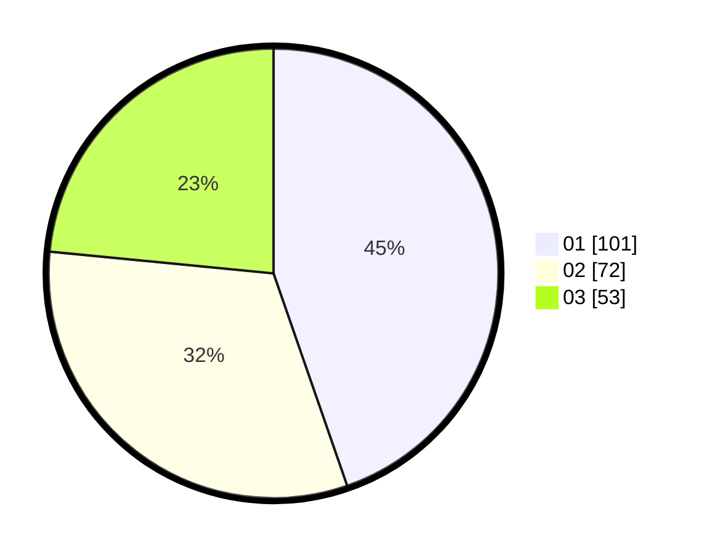

# Hasil

Hasil perolehan suara paslon dapat dilihat pada file paslon-01.txt, paslon-02.txt, dan paslon-03.txt.

Jika tidak ada, artinya data tersebut belum ada pada SIREKAP.

## Perolehan Suara

 * Paslon 01: **101**.
 * Paslon 02: **72**.
 * Paslon 03: **53**.

## Foto C Plano

https://sirekap-obj-formc.kpu.go.id/8603/pemilu/ppwp/31/73/08/10/02/3173081002069-20240214-155009--218275a5-5692-4993-9109-db6f48b30453.jpg

https://sirekap-obj-formc.kpu.go.id/8603/pemilu/ppwp/31/73/08/10/02/3173081002069-20240214-155634--8ffd455a-2fe2-4669-b5be-dbd2a863b9c3.jpg

https://sirekap-obj-formc.kpu.go.id/8603/pemilu/ppwp/31/73/08/10/02/3173081002069-20240216-103734--fcca49fe-7180-44b5-98c5-6af80390baf6.jpg

## DATA PEMILIH TETAP

Jumlah pemilih dalam DPT: **289**.
 * L: **143**.
 * P: **146**.

## DATA PENGGUNA HAK PILIH

Jumlah pengguna hak pilih dalam DPT: **226**.
 * L: **111**.
 * P: **115**.

Jumlah pengguna hak pilih dalam DPTb: **0**.
 * L: **0**.
 * P: **0**.

Jumlah pengguna hak pilih dalam DPK: **4**.
 * L: **2**.
 * P: **2**.

Jumlah pengguna hak pilih: **230**.
 * L: **113**.
 * P: **117**.

## JUMLAH SUARA SAH DAN TIDAK SAH

JUMLAH SELURUH SUARA SAH: **226**.

JUMLAH SUARA TIDAK SAH: **4**.

JUMLAH SELURUH SUARA SAH DAN SUARA TIDAK SAH: **230**.
