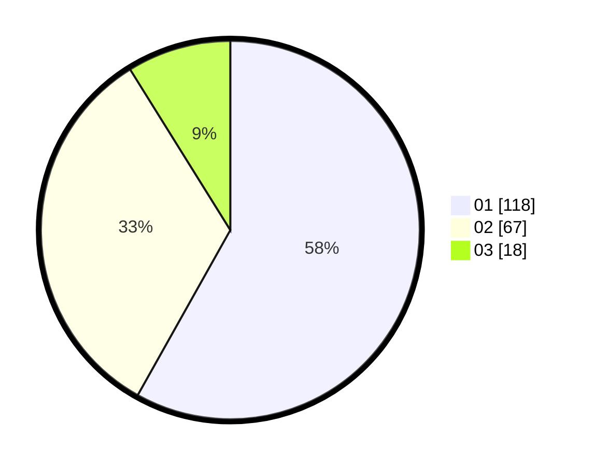

# Hasil

Hasil perolehan suara paslon dapat dilihat pada file paslon-01.txt, paslon-02.txt, dan paslon-03.txt.

Jika tidak ada, artinya data tersebut belum ada pada SIREKAP.

## Perolehan Suara

 * Paslon 01: **118**.
 * Paslon 02: **67**.
 * Paslon 03: **18**.

## Foto C Plano

https://sirekap-obj-formc.kpu.go.id/75ed/pemilu/ppwp/31/73/08/10/02/3173081002070-20240214-205542--5d512ebb-4769-40fa-9077-113f951c6062.jpg

https://sirekap-obj-formc.kpu.go.id/75ed/pemilu/ppwp/31/73/08/10/02/3173081002070-20240214-222403--426f3722-b634-42a9-8b97-98fbe43456d5.jpg

https://sirekap-obj-formc.kpu.go.id/75ed/pemilu/ppwp/31/73/08/10/02/3173081002070-20240214-205634--b3e20941-bae4-4590-8f19-2c67a3c65d63.jpg

## DATA PEMILIH TETAP

Jumlah pemilih dalam DPT: **286**.
 * L: **145**.
 * P: **141**.

## DATA PENGGUNA HAK PILIH

Jumlah pengguna hak pilih dalam DPT: **222**.
 * L: **111**.
 * P: **111**.

Jumlah pengguna hak pilih dalam DPTb: **1**.
 * L: **1**.
 * P: **0**.

Jumlah pengguna hak pilih dalam DPK: **3**.
 * L: **2**.
 * P: **1**.

Jumlah pengguna hak pilih: **226**.
 * L: **114**.
 * P: **112**.

## JUMLAH SUARA SAH DAN TIDAK SAH

JUMLAH SELURUH SUARA SAH: **203**.

JUMLAH SUARA TIDAK SAH: **23**.

JUMLAH SELURUH SUARA SAH DAN SUARA TIDAK SAH: **226**.
