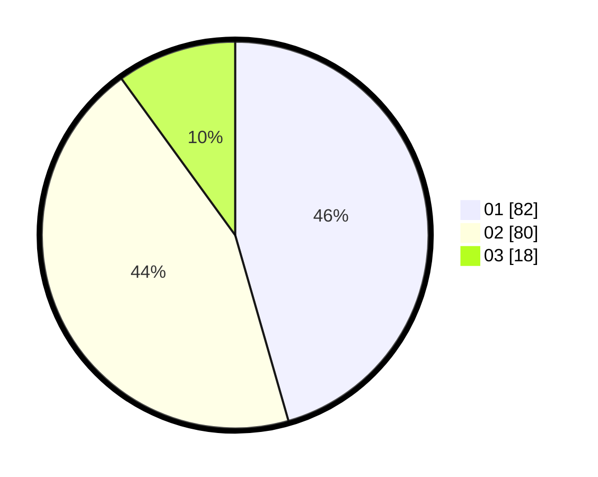

# Hasil

Hasil perolehan suara paslon dapat dilihat pada file paslon-01.txt, paslon-02.txt, dan paslon-03.txt.

Jika tidak ada, artinya data tersebut belum ada pada SIREKAP.

## Perolehan Suara

 * Paslon 01: **82**.
 * Paslon 02: **80**.
 * Paslon 03: **18**.

## Foto C Plano

https://sirekap-obj-formc.kpu.go.id/a268/pemilu/ppwp/31/73/08/10/02/3173081002076-20240215-023120--6ede30b1-4416-4a02-86ee-f70d73e1cc32.jpg

https://sirekap-obj-formc.kpu.go.id/a268/pemilu/ppwp/31/73/08/10/02/3173081002076-20240215-023418--2f9db632-cd1d-4445-bbe8-cb9dd7b826d0.jpg

https://sirekap-obj-formc.kpu.go.id/a268/pemilu/ppwp/31/73/08/10/02/3173081002076-20240215-025639--20a332f6-78ef-4449-a91e-dc382a457348.jpg
