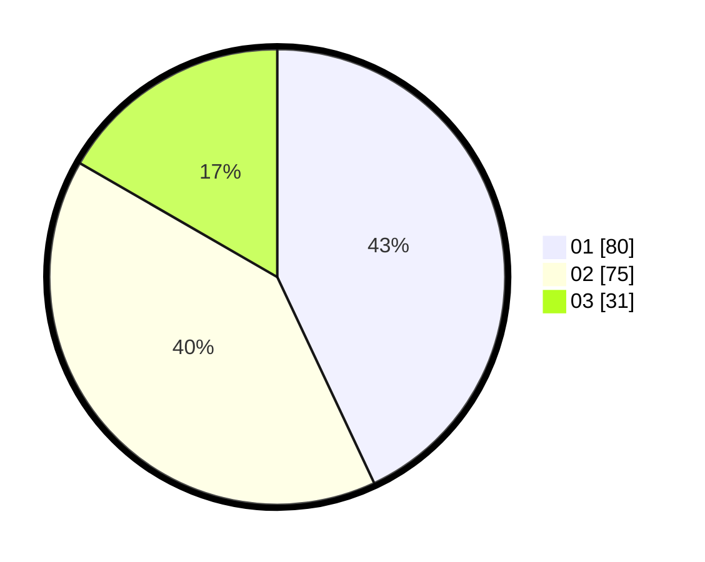

# Hasil

Hasil perolehan suara paslon dapat dilihat pada file paslon-01.txt, paslon-02.txt, dan paslon-03.txt.

Jika tidak ada, artinya data tersebut belum ada pada SIREKAP.

## Perolehan Suara

 * Paslon 01: **80**.
 * Paslon 02: **75**.
 * Paslon 03: **31**.

## Foto C Plano

https://sirekap-obj-formc.kpu.go.id/749b/pemilu/ppwp/31/73/08/10/02/3173081002077-20240214-230809--0205c07a-c598-44eb-b6f4-438179f1d035.jpg

https://sirekap-obj-formc.kpu.go.id/749b/pemilu/ppwp/31/73/08/10/02/3173081002077-20240214-230908--3081aac1-316a-4675-91f7-54e56d7cb702.jpg

https://sirekap-obj-formc.kpu.go.id/749b/pemilu/ppwp/31/73/08/10/02/3173081002077-20240214-231010--d45dfcfe-f75d-437a-b160-7bbea8911c81.jpg

## DATA PEMILIH TETAP

Jumlah pemilih dalam DPT: **267**.
 * L: **142**.
 * P: **125**.

## DATA PENGGUNA HAK PILIH

Jumlah pengguna hak pilih dalam DPT: **182**.
 * L: **92**.
 * P: **90**.

Jumlah pengguna hak pilih dalam DPTb: **2**.
 * L: **0**.
 * P: **2**.

Jumlah pengguna hak pilih dalam DPK: **4**.
 * L: **2**.
 * P: **2**.

Jumlah pengguna hak pilih: **188**.
 * L: **94**.
 * P: **94**.

## JUMLAH SUARA SAH DAN TIDAK SAH

JUMLAH SELURUH SUARA SAH: **186**.

JUMLAH SUARA TIDAK SAH: **2**.

JUMLAH SELURUH SUARA SAH DAN SUARA TIDAK SAH: **188**.
