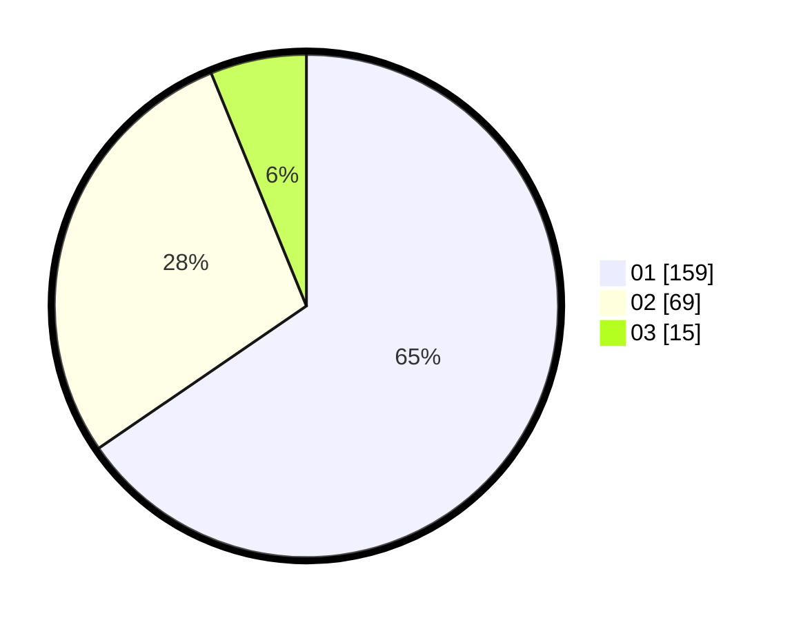

# Hasil

Hasil perolehan suara paslon dapat dilihat pada file paslon-01.txt, paslon-02.txt, dan paslon-03.txt.

Jika tidak ada, artinya data tersebut belum ada pada SIREKAP.

## Perolehan Suara

 * Paslon 01: **159**.
 * Paslon 02: **69**.
 * Paslon 03: **15**.

## Foto C Plano

https://sirekap-obj-formc.kpu.go.id/1f01/pemilu/ppwp/31/73/08/10/02/3173081002078-20240214-221443--c9751e76-5de7-4f82-b735-b535a2b2df8a.jpg

https://sirekap-obj-formc.kpu.go.id/1f01/pemilu/ppwp/31/73/08/10/02/3173081002078-20240214-221617--05261a6b-ba20-4fed-afe4-d603e803c9fb.jpg

https://sirekap-obj-formc.kpu.go.id/1f01/pemilu/ppwp/31/73/08/10/02/3173081002078-20240214-221811--61320913-7a41-4d67-9dc6-524f7ccd7914.jpg
