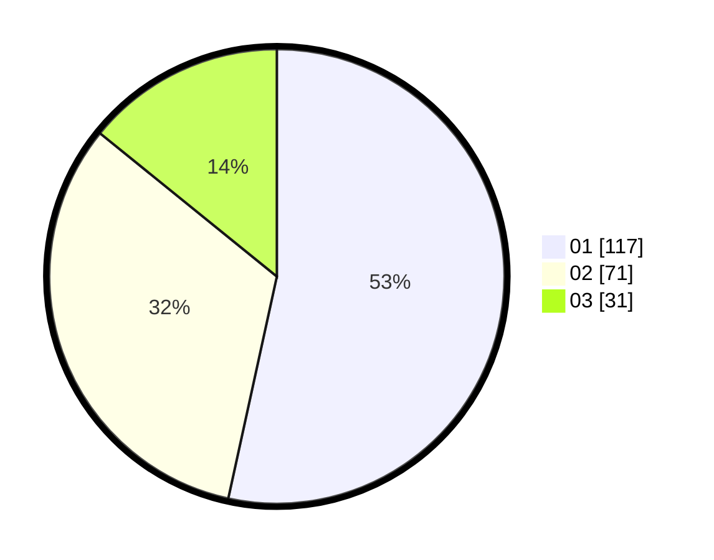

# Hasil

Hasil perolehan suara paslon dapat dilihat pada file paslon-01.txt, paslon-02.txt, dan paslon-03.txt.

Jika tidak ada, artinya data tersebut belum ada pada SIREKAP.

## Perolehan Suara

 * Paslon 01: **117**.
 * Paslon 02: **71**.
 * Paslon 03: **31**.

## Foto C Plano

https://sirekap-obj-formc.kpu.go.id/c87e/pemilu/ppwp/31/73/08/10/02/3173081002079-20240214-162239--883af358-0adf-499d-9436-be19cedc01ae.jpg

https://sirekap-obj-formc.kpu.go.id/c87e/pemilu/ppwp/31/73/08/10/02/3173081002079-20240214-200642--4f044e20-be7b-4514-bbbd-2610beb0ffbe.jpg

https://sirekap-obj-formc.kpu.go.id/c87e/pemilu/ppwp/31/73/08/10/02/3173081002079-20240214-200814--5f19ba11-9cab-4ee0-aec9-3dec027bbcd0.jpg

## DATA PEMILIH TETAP

Jumlah pemilih dalam DPT: **283**.
 * L: **138**.
 * P: **145**.

## DATA PENGGUNA HAK PILIH

Jumlah pengguna hak pilih dalam DPT: **220**.
 * L: **105**.
 * P: **115**.

Jumlah pengguna hak pilih dalam DPTb: **3**.
 * L: **2**.
 * P: **1**.

Jumlah pengguna hak pilih dalam DPK: **2**.
 * L: **2**.
 * P: **0**.

Jumlah pengguna hak pilih: **225**.
 * L: **109**.
 * P: **116**.

## JUMLAH SUARA SAH DAN TIDAK SAH

JUMLAH SELURUH SUARA SAH: **219**.

JUMLAH SUARA TIDAK SAH: **6**.

JUMLAH SELURUH SUARA SAH DAN SUARA TIDAK SAH: **225**.
