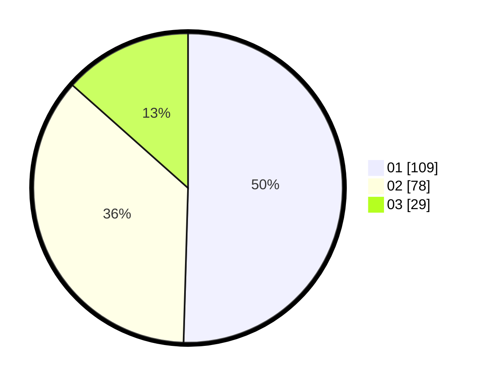

# Hasil

Hasil perolehan suara paslon dapat dilihat pada file paslon-01.txt, paslon-02.txt, dan paslon-03.txt.

Jika tidak ada, artinya data tersebut belum ada pada SIREKAP.

## Perolehan Suara

 * Paslon 01: **109**.
 * Paslon 02: **78**.
 * Paslon 03: **29**.

## Foto C Plano

https://sirekap-obj-formc.kpu.go.id/cacd/pemilu/ppwp/31/73/08/10/02/3173081002082-20240214-221236--97252019-cea3-434e-82ab-695fdfceea88.jpg

https://sirekap-obj-formc.kpu.go.id/cacd/pemilu/ppwp/31/73/08/10/02/3173081002082-20240214-155320--5620b91f-80e5-4276-90ad-0a7e133549b3.jpg

https://sirekap-obj-formc.kpu.go.id/cacd/pemilu/ppwp/31/73/08/10/02/3173081002082-20240214-155553--73b129a6-167d-4a07-9c6e-d8f0a3a225c1.jpg
