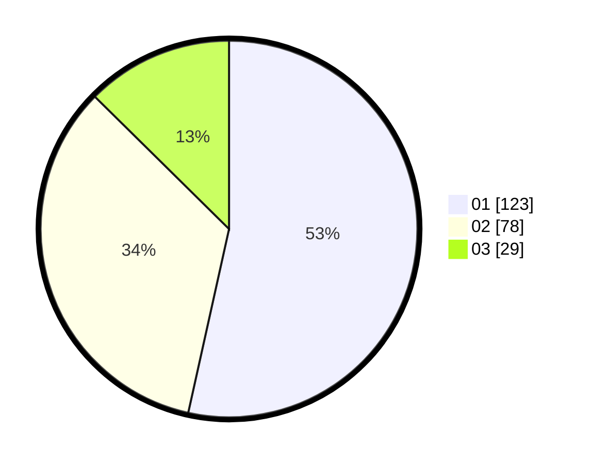

# Hasil

Hasil perolehan suara paslon dapat dilihat pada file paslon-01.txt, paslon-02.txt, dan paslon-03.txt.

Jika tidak ada, artinya data tersebut belum ada pada SIREKAP.

## Perolehan Suara

 * Paslon 01: **123**.
 * Paslon 02: **78**.
 * Paslon 03: **29**.

## Foto C Plano

https://sirekap-obj-formc.kpu.go.id/99f7/pemilu/ppwp/31/73/08/10/02/3173081002083-20240215-074402--98567d7f-f256-4b70-88f3-a50e625c24fb.jpg

https://sirekap-obj-formc.kpu.go.id/99f7/pemilu/ppwp/31/73/08/10/02/3173081002083-20240215-074424--da0aaf99-6296-46cd-a013-d8a0b5fdd99f.jpg

https://sirekap-obj-formc.kpu.go.id/99f7/pemilu/ppwp/31/73/08/10/02/3173081002083-20240215-074413--d6d70c1e-8862-4058-933c-aaa8f2d2d3ff.jpg

## DATA PEMILIH TETAP

Jumlah pemilih dalam DPT: **284**.
 * L: **132**.
 * P: **152**.

## DATA PENGGUNA HAK PILIH

Jumlah pengguna hak pilih dalam DPT: **213**.
 * L: **95**.
 * P: **118**.

Jumlah pengguna hak pilih dalam DPTb: **8**.
 * L: **2**.
 * P: **6**.

Jumlah pengguna hak pilih dalam DPK: **12**.
 * L: **6**.
 * P: **6**.

Jumlah pengguna hak pilih: **233**.
 * L: **103**.
 * P: **130**.

## JUMLAH SUARA SAH DAN TIDAK SAH

JUMLAH SELURUH SUARA SAH: **230**.

JUMLAH SUARA TIDAK SAH: **3**.

JUMLAH SELURUH SUARA SAH DAN SUARA TIDAK SAH: **233**.
