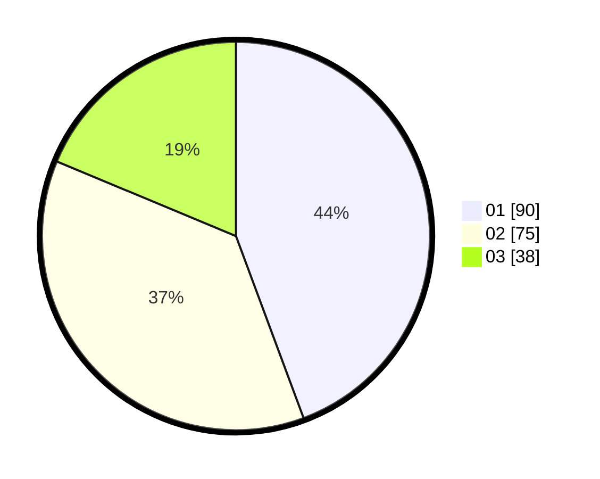

# Hasil

Hasil perolehan suara paslon dapat dilihat pada file paslon-01.txt, paslon-02.txt, dan paslon-03.txt.

Jika tidak ada, artinya data tersebut belum ada pada SIREKAP.

## Perolehan Suara

 * Paslon 01: **90**.
 * Paslon 02: **75**.
 * Paslon 03: **38**.

## Foto C Plano

https://sirekap-obj-formc.kpu.go.id/2e3b/pemilu/ppwp/31/73/08/10/02/3173081002084-20240216-055641--39ac7d86-dc7c-4d8a-89b5-bb8e3f414460.jpg

https://sirekap-obj-formc.kpu.go.id/2e3b/pemilu/ppwp/31/73/08/10/02/3173081002084-20240216-055643--ec657446-8095-479a-9c03-265b2e2685f5.jpg

https://sirekap-obj-formc.kpu.go.id/2e3b/pemilu/ppwp/31/73/08/10/02/3173081002084-20240216-055642--e61d088a-7382-4a72-ae7c-1cc8d951be29.jpg

## DATA PEMILIH TETAP

Jumlah pemilih dalam DPT: **282**.
 * L: **141**.
 * P: **141**.

## DATA PENGGUNA HAK PILIH

Jumlah pengguna hak pilih dalam DPT: **205**.
 * L: **100**.
 * P: **105**.

Jumlah pengguna hak pilih dalam DPTb: **7**.
 * L: **4**.
 * P: **3**.

Jumlah pengguna hak pilih dalam DPK: **6**.
 * L: **3**.
 * P: **3**.

Jumlah pengguna hak pilih: **218**.
 * L: **0**.
 * P: **0**.

## JUMLAH SUARA SAH DAN TIDAK SAH

JUMLAH SELURUH SUARA SAH: **203**.

JUMLAH SUARA TIDAK SAH: **3**.

JUMLAH SELURUH SUARA SAH DAN SUARA TIDAK SAH: **206**.
