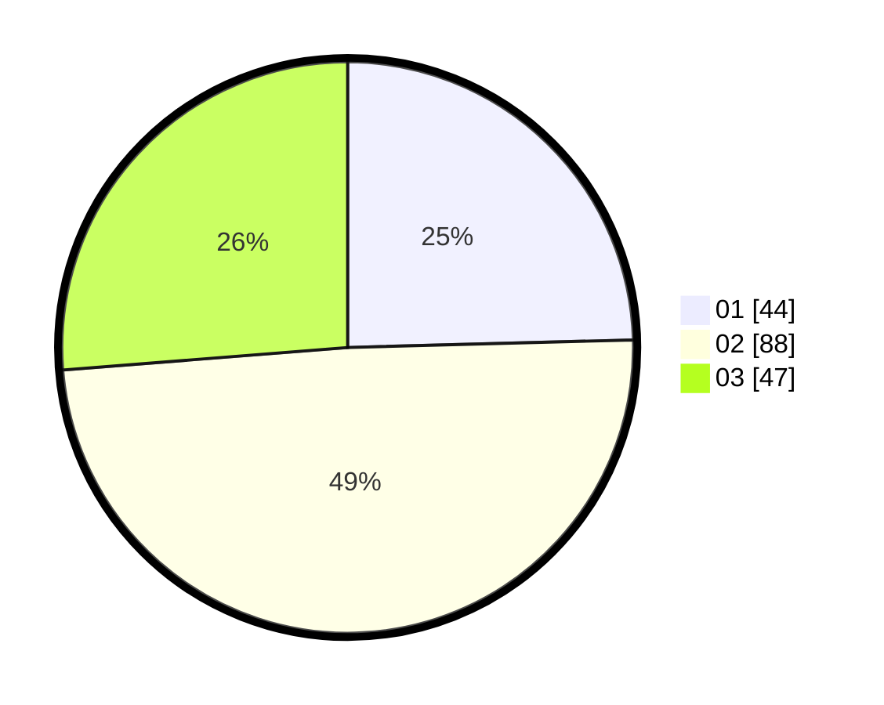

# Hasil

Hasil perolehan suara paslon dapat dilihat pada file paslon-01.txt, paslon-02.txt, dan paslon-03.txt.

Jika tidak ada, artinya data tersebut belum ada pada SIREKAP.

## Perolehan Suara

 * Paslon 01: **44**.
 * Paslon 02: **88**.
 * Paslon 03: **47**.

## Foto C Plano

https://sirekap-obj-formc.kpu.go.id/213f/pemilu/ppwp/31/73/08/10/02/3173081002086-20240215-213108--1f69bae4-1c9a-4f1d-82c4-051e7b6cf750.jpg

https://sirekap-obj-formc.kpu.go.id/213f/pemilu/ppwp/31/73/08/10/02/3173081002086-20240215-213110--a1f54d75-f572-47a7-be7f-ab310de5490f.jpg

https://sirekap-obj-formc.kpu.go.id/213f/pemilu/ppwp/31/73/08/10/02/3173081002086-20240215-213109--9fc8d703-6925-444c-b43e-a6603899eb5c.jpg

## DATA PEMILIH TETAP

Jumlah pemilih dalam DPT: **273**.
 * L: **125**.
 * P: **148**.

## DATA PENGGUNA HAK PILIH

Jumlah pengguna hak pilih dalam DPT: **169**.
 * L: **80**.
 * P: **89**.

Jumlah pengguna hak pilih dalam DPTb: **12**.
 * L: **5**.
 * P: **7**.

Jumlah pengguna hak pilih dalam DPK: **0**.
 * L: **0**.
 * P: **0**.

Jumlah pengguna hak pilih: **181**.
 * L: **85**.
 * P: **96**.

## JUMLAH SUARA SAH DAN TIDAK SAH

JUMLAH SELURUH SUARA SAH: **179**.

JUMLAH SUARA TIDAK SAH: **2**.

JUMLAH SELURUH SUARA SAH DAN SUARA TIDAK SAH: **181**.
