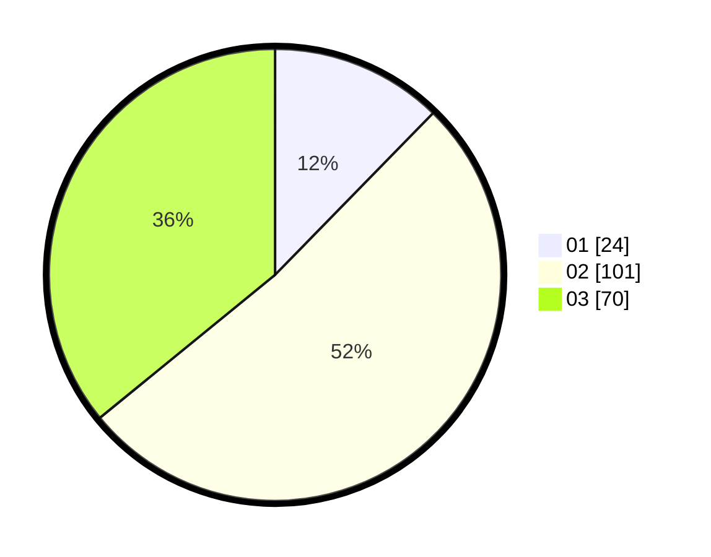

# Hasil

Hasil perolehan suara paslon dapat dilihat pada file paslon-01.txt, paslon-02.txt, dan paslon-03.txt.

Jika tidak ada, artinya data tersebut belum ada pada SIREKAP.

## Perolehan Suara

 * Paslon 01: **24**.
 * Paslon 02: **101**.
 * Paslon 03: **70**.

## Foto C Plano

https://sirekap-obj-formc.kpu.go.id/576b/pemilu/ppwp/31/73/08/10/02/3173081002088-20240214-211025--d02e3181-1865-461b-831f-b7ada5c301a6.jpg

https://sirekap-obj-formc.kpu.go.id/576b/pemilu/ppwp/31/73/08/10/02/3173081002088-20240214-211036--bb20376b-7f89-4ca1-bdc5-08e87ce52f2b.jpg

https://sirekap-obj-formc.kpu.go.id/576b/pemilu/ppwp/31/73/08/10/02/3173081002088-20240214-211042--631910d5-e2ac-48af-a441-a5b6b452c96a.jpg

## DATA PEMILIH TETAP

Jumlah pemilih dalam DPT: **273**.
 * L: **127**.
 * P: **146**.

## DATA PENGGUNA HAK PILIH

Jumlah pengguna hak pilih dalam DPT: **173**.
 * L: **84**.
 * P: **89**.

Jumlah pengguna hak pilih dalam DPTb: **21**.
 * L: **10**.
 * P: **11**.

Jumlah pengguna hak pilih dalam DPK: **1**.
 * L: **1**.
 * P: **0**.

Jumlah pengguna hak pilih: **195**.
 * L: **95**.
 * P: **100**.

## JUMLAH SUARA SAH DAN TIDAK SAH

JUMLAH SELURUH SUARA SAH: **195**.

JUMLAH SUARA TIDAK SAH: **0**.

JUMLAH SELURUH SUARA SAH DAN SUARA TIDAK SAH: **195**.
