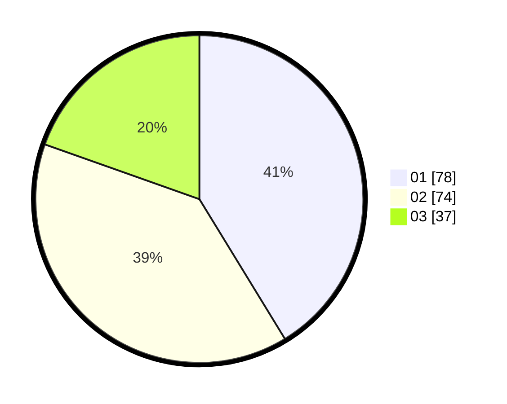

# Hasil

Hasil perolehan suara paslon dapat dilihat pada file paslon-01.txt, paslon-02.txt, dan paslon-03.txt.

Jika tidak ada, artinya data tersebut belum ada pada SIREKAP.

## Perolehan Suara

 * Paslon 01: **78**.
 * Paslon 02: **74**.
 * Paslon 03: **37**.

## Foto C Plano

https://sirekap-obj-formc.kpu.go.id/a35d/pemilu/ppwp/31/73/08/10/02/3173081002091-20240216-141002--df30150c-1d0a-4c71-9c20-7ab381a17791.jpg

https://sirekap-obj-formc.kpu.go.id/a35d/pemilu/ppwp/31/73/08/10/02/3173081002091-20240216-141004--76a8db54-9b67-46f6-998f-29b0422ff54f.jpg

https://sirekap-obj-formc.kpu.go.id/a35d/pemilu/ppwp/31/73/08/10/02/3173081002091-20240216-141003--5221ae14-e3ac-4708-ba6e-f79b2ef86deb.jpg

## DATA PEMILIH TETAP

Jumlah pemilih dalam DPT: **278**.
 * L: **146**.
 * P: **132**.

## DATA PENGGUNA HAK PILIH

Jumlah pengguna hak pilih dalam DPT: **191**.
 * L: **100**.
 * P: **91**.

Jumlah pengguna hak pilih dalam DPTb: **1**.
 * L: **0**.
 * P: **1**.

Jumlah pengguna hak pilih dalam DPK: **0**.
 * L: **0**.
 * P: **0**.

Jumlah pengguna hak pilih: **192**.
 * L: **100**.
 * P: **92**.

## JUMLAH SUARA SAH DAN TIDAK SAH

JUMLAH SELURUH SUARA SAH: **189**.

JUMLAH SUARA TIDAK SAH: **3**.

JUMLAH SELURUH SUARA SAH DAN SUARA TIDAK SAH: **192**.
