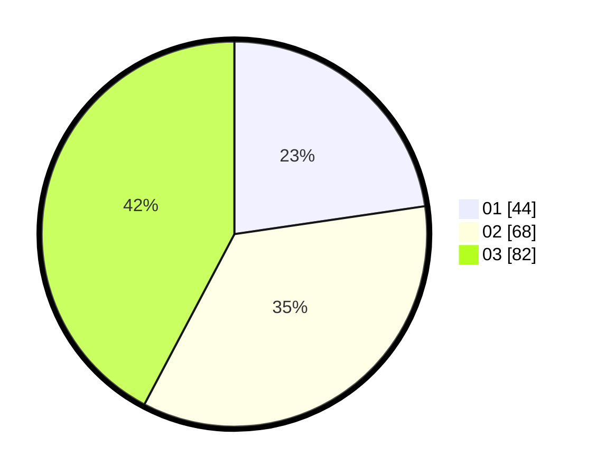

# Hasil

Hasil perolehan suara paslon dapat dilihat pada file paslon-01.txt, paslon-02.txt, dan paslon-03.txt.

Jika tidak ada, artinya data tersebut belum ada pada SIREKAP.

## Perolehan Suara

 * Paslon 01: **44**.
 * Paslon 02: **68**.
 * Paslon 03: **82**.

## Foto C Plano

https://sirekap-obj-formc.kpu.go.id/1473/pemilu/ppwp/31/73/08/10/02/3173081002097-20240214-160106--6fea6f92-a983-4d8b-865c-358344506e0f.jpg

https://sirekap-obj-formc.kpu.go.id/1473/pemilu/ppwp/31/73/08/10/02/3173081002097-20240215-211902--904df197-2488-4f4d-889d-53549d4a9503.jpg

https://sirekap-obj-formc.kpu.go.id/1473/pemilu/ppwp/31/73/08/10/02/3173081002097-20240214-194858--03d8619c-5210-4531-9104-9221f5c3ae30.jpg

## DATA PEMILIH TETAP

Jumlah pemilih dalam DPT: **196**.
 * L: **86**.
 * P: **110**.

## DATA PENGGUNA HAK PILIH

Jumlah pengguna hak pilih dalam DPT: **188**.
 * L: **84**.
 * P: **104**.

Jumlah pengguna hak pilih dalam DPTb: **6**.
 * L: **1**.
 * P: **5**.

Jumlah pengguna hak pilih dalam DPK: **2**.
 * L: **1**.
 * P: **1**.

Jumlah pengguna hak pilih: **196**.
 * L: **86**.
 * P: **110**.

## JUMLAH SUARA SAH DAN TIDAK SAH

JUMLAH SELURUH SUARA SAH: **194**.

JUMLAH SUARA TIDAK SAH: **2**.

JUMLAH SELURUH SUARA SAH DAN SUARA TIDAK SAH: **196**.
