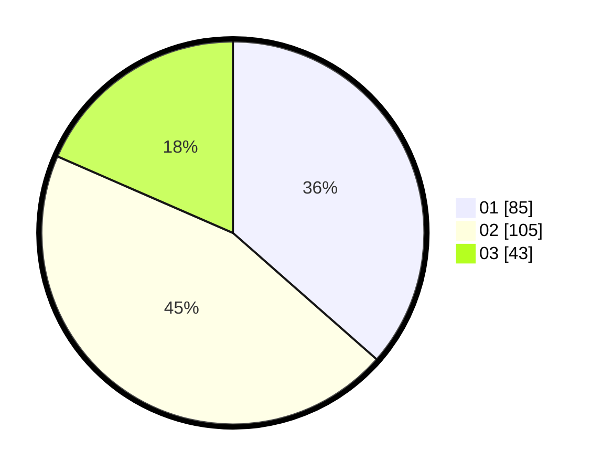

# Hasil

Hasil perolehan suara paslon dapat dilihat pada file paslon-01.txt, paslon-02.txt, dan paslon-03.txt.

Jika tidak ada, artinya data tersebut belum ada pada SIREKAP.

## Perolehan Suara

 * Paslon 01: **85**.
 * Paslon 02: **105**.
 * Paslon 03: **43**.

## Foto C Plano

https://sirekap-obj-formc.kpu.go.id/39d6/pemilu/ppwp/31/73/08/10/02/3173081002100-20240214-201002--4028fb09-8a0b-4767-9a8b-1db912121c94.jpg

https://sirekap-obj-formc.kpu.go.id/39d6/pemilu/ppwp/31/73/08/10/02/3173081002100-20240214-201205--20558d72-a07f-4dd7-8db9-d10203ec60f5.jpg

https://sirekap-obj-formc.kpu.go.id/39d6/pemilu/ppwp/31/73/08/10/02/3173081002100-20240214-201259--00bb6c57-a224-4f80-84d2-98c223306982.jpg

## DATA PEMILIH TETAP

Jumlah pemilih dalam DPT: **289**.
 * L: **142**.
 * P: **147**.

## DATA PENGGUNA HAK PILIH

Jumlah pengguna hak pilih dalam DPT: **228**.
 * L: **105**.
 * P: **123**.

Jumlah pengguna hak pilih dalam DPTb: **5**.
 * L: **1**.
 * P: **4**.

Jumlah pengguna hak pilih dalam DPK: **4**.
 * L: **3**.
 * P: **1**.

Jumlah pengguna hak pilih: **237**.
 * L: **109**.
 * P: **128**.

## JUMLAH SUARA SAH DAN TIDAK SAH

JUMLAH SELURUH SUARA SAH: **233**.

JUMLAH SUARA TIDAK SAH: **4**.

JUMLAH SELURUH SUARA SAH DAN SUARA TIDAK SAH: **237**.
