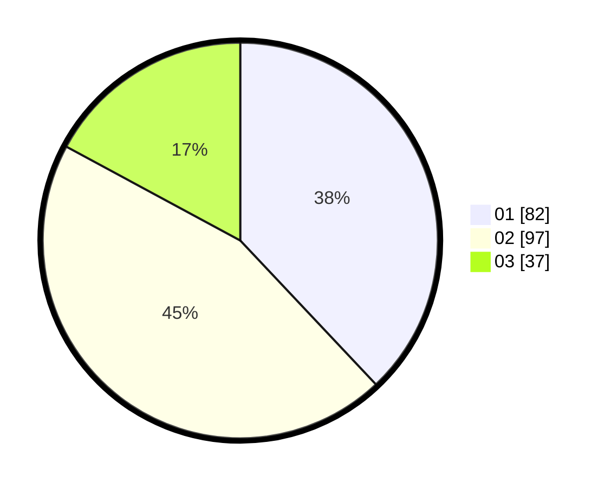

# Hasil

Hasil perolehan suara paslon dapat dilihat pada file paslon-01.txt, paslon-02.txt, dan paslon-03.txt.

Jika tidak ada, artinya data tersebut belum ada pada SIREKAP.

## Perolehan Suara

 * Paslon 01: **82**.
 * Paslon 02: **97**.
 * Paslon 03: **37**.

## Foto C Plano

https://sirekap-obj-formc.kpu.go.id/6ea8/pemilu/ppwp/31/73/08/10/02/3173081002101-20240214-203615--51a89404-d035-4691-ace9-11b01e77f871.jpg

https://sirekap-obj-formc.kpu.go.id/6ea8/pemilu/ppwp/31/73/08/10/02/3173081002101-20240214-203721--0064315a-c7ae-4a0f-91f4-c398ce33bdba.jpg

https://sirekap-obj-formc.kpu.go.id/6ea8/pemilu/ppwp/31/73/08/10/02/3173081002101-20240214-203812--1147a4c5-a083-4fe0-b228-223002d9f2e5.jpg
