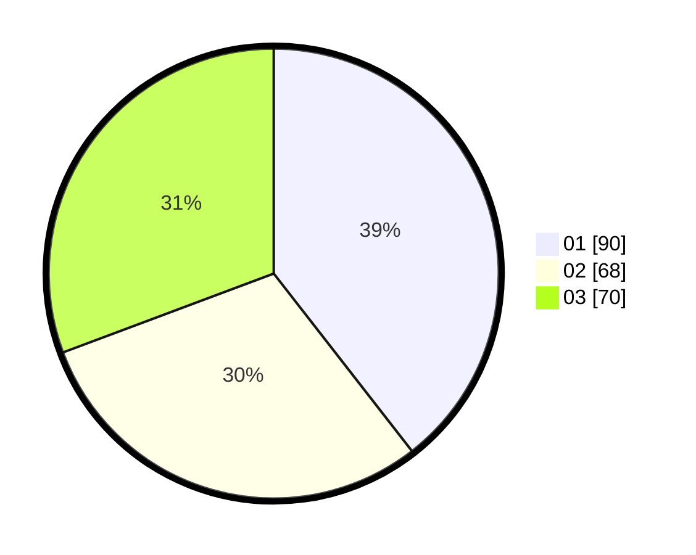

# Hasil

Hasil perolehan suara paslon dapat dilihat pada file paslon-01.txt, paslon-02.txt, dan paslon-03.txt.

Jika tidak ada, artinya data tersebut belum ada pada SIREKAP.

## Perolehan Suara

 * Paslon 01: **90**.
 * Paslon 02: **68**.
 * Paslon 03: **70**.

## Foto C Plano

https://sirekap-obj-formc.kpu.go.id/d9e0/pemilu/ppwp/31/73/08/10/02/3173081002105-20240214-220818--69e846e3-df32-4b9f-b796-bf7366798527.jpg

https://sirekap-obj-formc.kpu.go.id/d9e0/pemilu/ppwp/31/73/08/10/02/3173081002105-20240214-220956--67cab0be-ee62-45e9-8483-2341d00b49c4.jpg

https://sirekap-obj-formc.kpu.go.id/d9e0/pemilu/ppwp/31/73/08/10/02/3173081002105-20240214-221131--1543f45d-6799-4270-a094-ffcf18626905.jpg

## DATA PEMILIH TETAP

Jumlah pemilih dalam DPT: **277**.
 * L: **127**.
 * P: **150**.

## DATA PENGGUNA HAK PILIH

Jumlah pengguna hak pilih dalam DPT: **230**.
 * L: **106**.
 * P: **124**.

Jumlah pengguna hak pilih dalam DPTb: **0**.
 * L: **0**.
 * P: **0**.

Jumlah pengguna hak pilih dalam DPK: **0**.
 * L: **0**.
 * P: **0**.

Jumlah pengguna hak pilih: **230**.
 * L: **106**.
 * P: **124**.

## JUMLAH SUARA SAH DAN TIDAK SAH

JUMLAH SELURUH SUARA SAH: **228**.

JUMLAH SUARA TIDAK SAH: **2**.

JUMLAH SELURUH SUARA SAH DAN SUARA TIDAK SAH: **230**.
