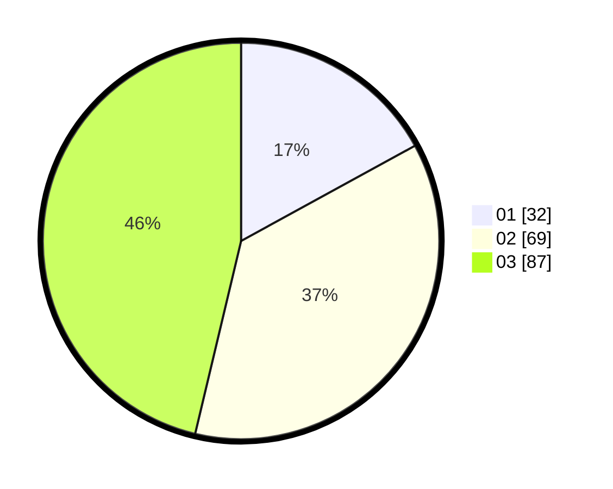

# Hasil

Hasil perolehan suara paslon dapat dilihat pada file paslon-01.txt, paslon-02.txt, dan paslon-03.txt.

Jika tidak ada, artinya data tersebut belum ada pada SIREKAP.

## Perolehan Suara

 * Paslon 01: **32**.
 * Paslon 02: **69**.
 * Paslon 03: **87**.

## Foto C Plano

https://sirekap-obj-formc.kpu.go.id/216c/pemilu/ppwp/31/73/08/10/02/3173081002110-20240214-210340--bb0b633c-12ba-45f9-89a9-ec675efa709a.jpg

https://sirekap-obj-formc.kpu.go.id/216c/pemilu/ppwp/31/73/08/10/02/3173081002110-20240214-210402--811c7d63-d5df-454c-9b26-dfd7831bf537.jpg

https://sirekap-obj-formc.kpu.go.id/216c/pemilu/ppwp/31/73/08/10/02/3173081002110-20240215-010542--1957f8ca-cdc8-4260-958d-f25c2d012e79.jpg
