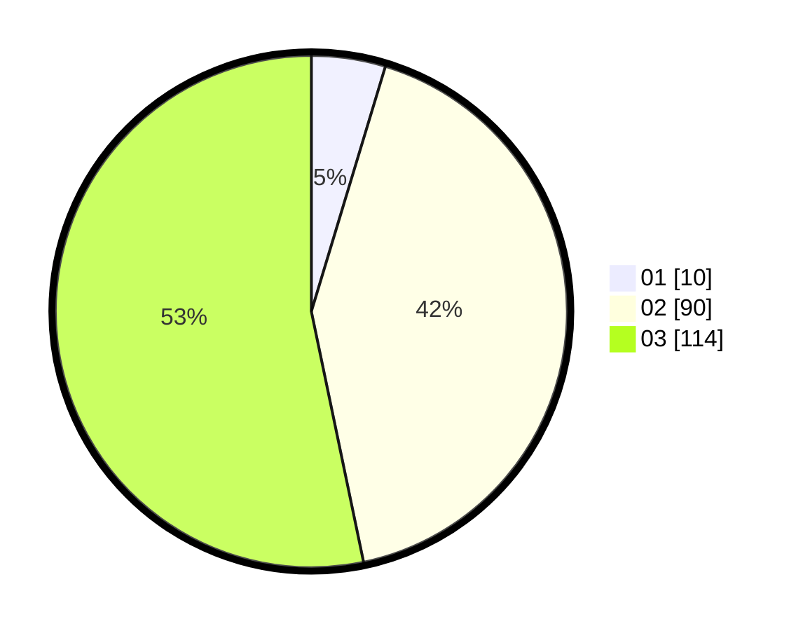

# Hasil

Hasil perolehan suara paslon dapat dilihat pada file paslon-01.txt, paslon-02.txt, dan paslon-03.txt.

Jika tidak ada, artinya data tersebut belum ada pada SIREKAP.

## Perolehan Suara

 * Paslon 01: **10**.
 * Paslon 02: **90**.
 * Paslon 03: **114**.

## Foto C Plano

https://sirekap-obj-formc.kpu.go.id/e333/pemilu/ppwp/31/73/08/10/02/3173081002114-20240214-193642--83b33223-ab09-4ba1-9bf4-f08058606416.jpg

https://sirekap-obj-formc.kpu.go.id/e333/pemilu/ppwp/31/73/08/10/02/3173081002114-20240214-193757--fc5f1709-7fe5-40c0-9fec-40147a9d295d.jpg

https://sirekap-obj-formc.kpu.go.id/e333/pemilu/ppwp/31/73/08/10/02/3173081002114-20240214-193837--cd4824a5-6d30-47f6-b02f-cb0f5c6ecc5a.jpg

## DATA PEMILIH TETAP

Jumlah pemilih dalam DPT: **273**.
 * L: **127**.
 * P: **146**.

## DATA PENGGUNA HAK PILIH

Jumlah pengguna hak pilih dalam DPT: **204**.
 * L: **91**.
 * P: **113**.

Jumlah pengguna hak pilih dalam DPTb: **10**.
 * L: **4**.
 * P: **6**.

Jumlah pengguna hak pilih dalam DPK: **3**.
 * L: **1**.
 * P: **2**.

Jumlah pengguna hak pilih: **217**.
 * L: **96**.
 * P: **121**.

## JUMLAH SUARA SAH DAN TIDAK SAH

JUMLAH SELURUH SUARA SAH: **214**.

JUMLAH SUARA TIDAK SAH: **3**.

JUMLAH SELURUH SUARA SAH DAN SUARA TIDAK SAH: **217**.
