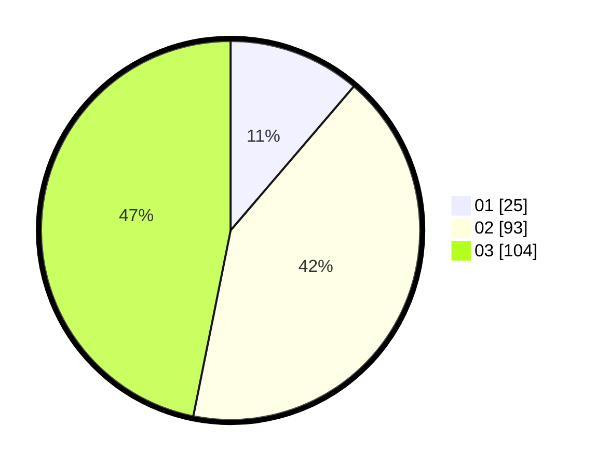

# Hasil

Hasil perolehan suara paslon dapat dilihat pada file paslon-01.txt, paslon-02.txt, dan paslon-03.txt.

Jika tidak ada, artinya data tersebut belum ada pada SIREKAP.

## Perolehan Suara

 * Paslon 01: **25**.
 * Paslon 02: **93**.
 * Paslon 03: **104**.

## Foto C Plano

https://sirekap-obj-formc.kpu.go.id/61a4/pemilu/ppwp/31/73/08/10/02/3173081002115-20240214-194813--c9f0d093-17bc-4932-b665-07d9bc2fa0ed.jpg

https://sirekap-obj-formc.kpu.go.id/61a4/pemilu/ppwp/31/73/08/10/02/3173081002115-20240214-193745--a645e9e2-6c0e-414c-a7cf-e7b46a3e1085.jpg

https://sirekap-obj-formc.kpu.go.id/61a4/pemilu/ppwp/31/73/08/10/02/3173081002115-20240214-195812--c56839c6-c6a1-4447-ade8-e045c31e3025.jpg
