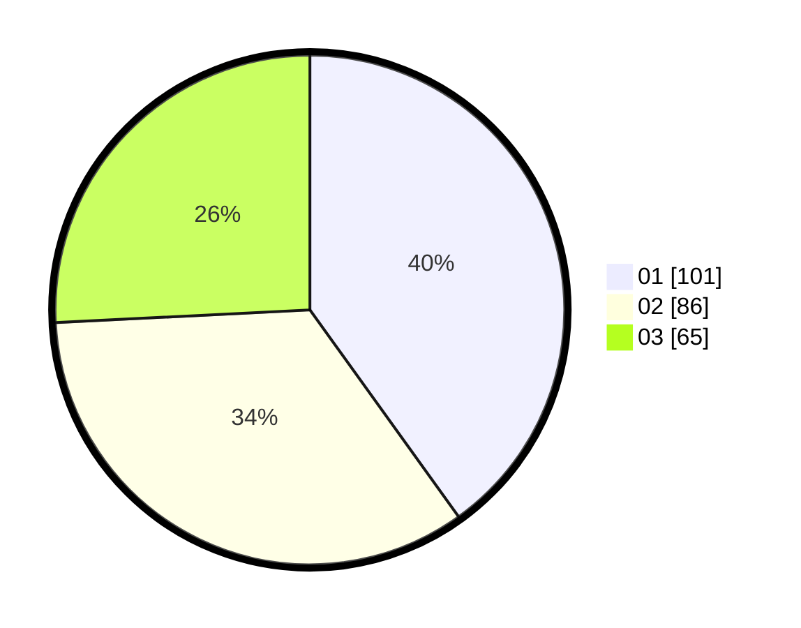

# Hasil

Hasil perolehan suara paslon dapat dilihat pada file paslon-01.txt, paslon-02.txt, dan paslon-03.txt.

Jika tidak ada, artinya data tersebut belum ada pada SIREKAP.

## Perolehan Suara

 * Paslon 01: **101**.
 * Paslon 02: **86**.
 * Paslon 03: **65**.

## Foto C Plano

https://sirekap-obj-formc.kpu.go.id/a283/pemilu/ppwp/31/73/08/10/02/3173081002120-20240215-010706--3e74656d-b912-47df-9323-467a8ee32ed1.jpg

https://sirekap-obj-formc.kpu.go.id/a283/pemilu/ppwp/31/73/08/10/02/3173081002120-20240215-010819--56b26464-2370-40ea-9b39-bd0f8cb54620.jpg

https://sirekap-obj-formc.kpu.go.id/a283/pemilu/ppwp/31/73/08/10/02/3173081002120-20240215-010908--ad5e6c3c-f1a6-46e5-82f8-b1d0522d9c9a.jpg
