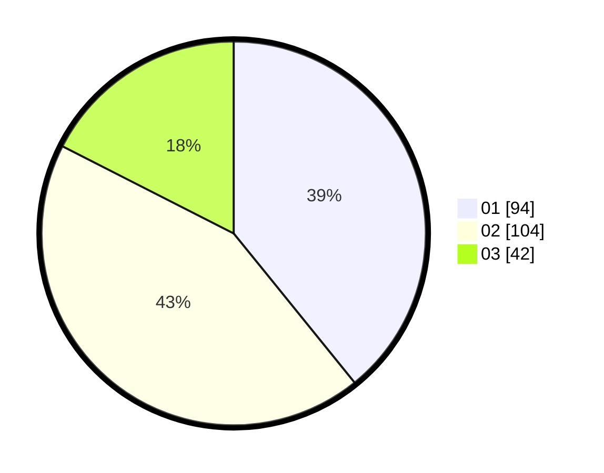

# Hasil

Hasil perolehan suara paslon dapat dilihat pada file paslon-01.txt, paslon-02.txt, dan paslon-03.txt.

Jika tidak ada, artinya data tersebut belum ada pada SIREKAP.

## Perolehan Suara

 * Paslon 01: **94**.
 * Paslon 02: **104**.
 * Paslon 03: **42**.

## Foto C Plano

https://sirekap-obj-formc.kpu.go.id/2635/pemilu/ppwp/31/73/08/10/02/3173081002121-20240214-212728--e6ddd709-c3a4-464f-ab06-7f994c4b5fdd.jpg

https://sirekap-obj-formc.kpu.go.id/2635/pemilu/ppwp/31/73/08/10/02/3173081002121-20240214-212543--46879385-fe24-4a4b-872d-644e8f4a7c5a.jpg

https://sirekap-obj-formc.kpu.go.id/2635/pemilu/ppwp/31/73/08/10/02/3173081002121-20240214-190705--3a8e25e1-0220-4136-b0c9-d6dd1a9b720f.jpg
